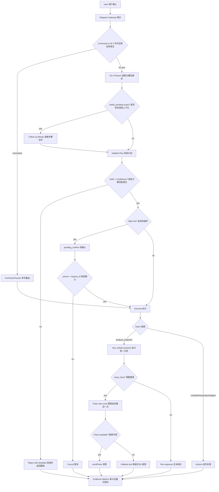
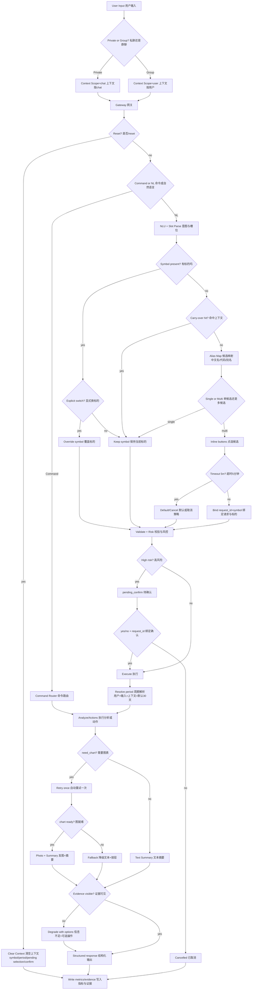

# Alpha-Insight

Alpha-Insight 是一个基于 LangGraph 的多 Agent 量化投研系统，支持沙箱执行、行情抓取、自动纠错、研报输出与 Telegram 推送。

## 已完成范围（第 1-4 周）

- 第 1 周：沙箱管理、行情数据工具、爬虫回退、Telegram 基础推送
- 第 2 周：`Planner -> Coder -> Executor -> Debugger` 自修复闭环
- 第 3 周：MACD/RSI、向量化回测、多模态研报、HITL 人工确认
- 第 4 周：实时异动扫描、分级告警、Streamlit 驾驶舱、安全 Guardrails、观测封装

## 当前可用功能（在历史能力基础上的增量）

- 三市场监控：A 股 / 港股 / 美股，支持 Top100 监控池
- 公司名展示：前端与告警统一展示公司名，支持 `代码(公司名)` 与 `代码 | 公司名`
- Telegram 告警：分级告警文案中英双语，字段统一（价格/涨跌幅/RSI/原因/时间）
- Telegram 命令增强（Phase D）：`/report <run_id|request_id>`、`/digest daily`、`/monitor <symbol> <interval> [volatility|price|rsi]`
- 双前端页面：
  - `8501` 实时驾驶舱（扫描、信号、流水线、告警）
  - `8502` Planner 控制台（规划）+ Full Analysis（完整分析产物）
- Full Analysis 模式：可展示沙箱代码、stdout/stderr、traceback、重试次数
- 沙箱容灾：Docker 沙箱不可用（如 `docker.sock permission denied`）时，自动回退本地进程执行（仍受 guardrails）

## Telegram 体验升级（Upgrade5 规划）

当前仓库已完成升级4（clarify follow-up、可解释降级、evidence），升级5聚焦“股民友好”交互：

- 上下文记忆：`last_symbol + last_period`（默认 TTL 30min）
- 显式换标的优先：如“不是腾讯，是阿里”立即切换
- 候选点选：多候选代码（如 `0700.HK/TCEHY`）用按钮选择，且绑定 `request_id`
- 点选超时策略：5 分钟后自动取消（或默认主市场代码并回显）
- `/reset`：清空 symbol/period/候选点选/待确认上下文
- 证据优先：无证据不输出技术结论评分
- 图表策略：先自动重试一次，再降级文本并给下一步按钮
- 每条回复带 `request_id(short)`（有 run 则附 `run_id`）

详细设计见：

- [升级5.md](升级5.md)

### 当前业务流程图（Telegram / 双语）



### 流程说明（详细双语）

1. 入口分流（Ingress Routing）  
   用户消息先进入 `TelegramGateway`，按是否以 `/` 开头分流到命令路由或自然语言解析。

2. 命令链路（Command Path）  
   命令走既有稳定链路（`/analyze /monitor /list /stop /report /digest`），保持向后兼容，不受 NL 变更影响。

3. 自然语言解析（NL Understanding）  
   NL 文本由 Planner 产出 `intent + slots + confidence`；如果存在 `clarify_pending`，优先做 follow-up 补槽承接。

4. 校验与拒绝（Validation & Rejection）  
   执行前做 deterministic 校验（symbol/period/interval/template 等）；不通过则返回用户友好模板，不执行危险动作。

5. 高风险确认（High-risk Confirmation）  
   高风险意图必须进入 `pending_confirm`，通过 `yes/no + request_id` 绑定确认，避免串单与误执行。

6. 执行动作（Action Execution）  
   分析意图调用统一研究流程，管理意图走 Telegram actions（监控、列表、停止、报告、日报）。

7. 图表策略（Chart Strategy）  
   请求图表时先尝试生成/提取，失败自动重试一次；仍失败时降级文本并给下一步按钮，不静默失败。

8. 结果与证据（Response & Evidence）  
   对用户输出结构化响应（含 `request_id`，可选 `run_id`）；同时写入 metrics/audit/evidence，支持追溯和运营统计。

### 升级5目标态流程图（Target Flow / 双语）



### 升级后预期问答（示例）

1. `看看K线图` -> 机器人询问标的或候选按钮
2. `腾讯的` -> 承接执行，返回 `Snapshot + 数据时间 + 数据来源 + request_id/run_id`
3. `看看新闻怎么说` -> 默认沿用当前标的与周期，回显 `news_count + 时间窗 + 来源`
4. `不是腾讯，是阿里` -> 立即切换标的，不再追问
5. 图表失败 -> 自动重试一次；仍失败则给“原因（用户语言）+ 按钮菜单（重试/扩窗/报告）”

## 目录结构

- `agents/`：工作流与 Agent 逻辑（`planner_engine.py`, `workflow_engine.py`, `report_workflow.py`, `scanner_engine.py`）
- `core/`：沙箱、模型、安全策略、观测模块
- `tools/`：行情、Telegram、产物提取
- `scripts/`：集成脚本、定时任务脚本、真实 LLM 测试脚本
- `ui/`：前端页面（Streamlit，含运行态可观测面板）
- `tests/`：Week1-Week4 的 pytest 测试
- `models/`：模型目录（本项目当前主要使用远程 API 模型，见 `models/MODELS.md`）

## 环境准备

1. 创建并填写 `.env`（已提供 `.env.example`）：

```bash
cp .env.example .env
```

2. 关键变量：

- `OPENAI_API_KEY`
- `OPENAI_API_BASE`（例如 DashScope OpenAI 兼容地址）
- `OPENAI_MODEL_NAME`（例如 `qwen3-32b`）
- `TEMPERATURE`
- `ENABLE_LOCAL_FALLBACK`
- `TELEGRAM_BOT_TOKEN`（可选）
- `TELEGRAM_CHAT_ID`（可选）
- `TELEGRAM_ACCESS_MODE`（`blacklist`/`allowlist`，默认 `blacklist`）
- `TELEGRAM_ALLOWED_CHAT_IDS`（allowlist 模式下生效）
- `TELEGRAM_BLOCKED_CHAT_IDS`（blacklist 模式下生效）

3. 推荐本地 Python 环境（与当前测试一致）：

```bash
python3 -m venv .venv_local
.venv_local/bin/pip install -r requirements-dev.txt
```

## 测试

```bash
docker compose --env-file .env run --rm test
```

或本地：

```bash
.venv_local/bin/python -m pytest -q
```

## 硬口径验收证据（Run Report + 离线20次）

已提供固定证据脚本：`scripts/hard_acceptance_evidence.py`，默认将产物写入 `docs/evidence/`。

1. 生成最新一次 run_report（样例）：

```bash
PYTHONPATH=/home/kkk/Project/Alpha-Insight python scripts/hard_acceptance_evidence.py generate --runs 1 --offline --output-json docs/evidence/run_report_latest.json --output-md docs/evidence/run_report_latest.md --title "Run Report (Latest Full Analysis)"
```

2. 生成离线 Docker Full Analysis 20 次统计：

```bash
PYTHONPATH=/home/kkk/Project/Alpha-Insight python scripts/hard_acceptance_evidence.py generate --runs 20 --offline --output-json docs/evidence/offline_docker_full_analysis_20.json --output-md docs/evidence/offline_docker_full_analysis_20.md --title "Offline Docker Full Analysis Benchmark (20 Runs)"
```

3. 记录 pytest 门禁结果：

```bash
PYTHONPATH=/home/kkk/Project/Alpha-Insight pytest -q | tee docs/evidence/pytest_gate_latest.txt
```

字段覆盖：`success/fallback/retry/latency/backend/failure_type`，用于硬口径复盘与回归对比。

## 后端启动

### Telegram 一键启停（Gateway + Scheduler）

```bash
chmod +x scripts/telegram_stack.sh
scripts/telegram_stack.sh start
scripts/telegram_stack.sh status
scripts/telegram_stack.sh restart
scripts/telegram_stack.sh stop
```

默认读取 `.env`，并使用 `storage/telegram_gateway_live.db`。可通过环境变量覆盖：
`ENV_FILE`、`TELEGRAM_GATEWAY_DB`、`TELEGRAM_POLL_TIMEOUT_SECONDS`、`TELEGRAM_IDLE_SLEEP_SECONDS`。

### 1) 实时异动扫描（可用于 Cron）

单次执行（推荐给 cron 调度）：

```bash
docker compose --env-file .env run --rm dev bash -lc "export PYTHONPATH=/workspace && python scripts/hourly_watchlist_scan.py --once --watchlist 'AAPL,MSFT,TSLA' --market us --granularity hour --mode anomaly"
```

常驻循环（默认每小时一次）：

```bash
docker compose --env-file .env run --rm dev bash -lc "export PYTHONPATH=/workspace && python scripts/hourly_watchlist_scan.py --market cn --top100 --granularity day"
```

可选市场：`us | hk | cn | auto`

阈值告警参数（D'）：

- `--fallback-spike-rate`：回退占比阈值（默认 `0.25`）
- `--failure-spike-count`：失败数阈值（默认 `3`）
- `--latency-anomaly-ms`：延迟阈值（默认 `2500`）

### 2) 真实 LLM 连通性测试

```bash
docker compose --env-file .env run --rm dev bash -lc "export PYTHONPATH=/workspace && python scripts/real_llm_smoke_test.py"
```

## 前端启动

当前有两个 Streamlit 页面，可并行启动：

### A. 实时驾驶舱（8501）

```bash
docker compose --env-file .env run --rm -d --name alpha-insight-ui-cockpit -p 8501:8501 dev bash -lc "export PYTHONPATH=/workspace && streamlit run ui/streamlit_dashboard.py --server.address 0.0.0.0 --server.port 8501"
```

打开：`http://localhost:8501`

能力说明：

- 启动即展示 Top100 成分（代码 + 公司名）
- 三市场切换、粒度切换（日/时/分）
- 信号图与信号表显示 `代码(公司名)`
- Telegram 预览与发送
- Runtime Log 中英双语

### B. Planner 控制台 + Full Analysis（8502）

```bash
docker compose --env-file .env run --rm -d --name alpha-insight-ui-llm -p 8502:8501 dev bash -lc "scripts/run_llm_frontend.sh"
```

打开：`http://localhost:8502`

能力说明：

- `Run Planner`：仅做规划（steps/data_source/reason）
- `Run Full Analysis`：执行 Week2 全流程并显示完整产物
  - sandbox code
  - sandbox stdout / stderr
  - traceback
  - retry count / success

查看运行状态：

```bash
docker ps --format "table {{.Names}}\t{{.Status}}\t{{.Ports}}"
```

查看日志：

```bash
docker logs -f alpha-insight-ui-cockpit
docker logs -f alpha-insight-ui-llm
```

停止前端：

```bash
docker stop alpha-insight-ui-cockpit alpha-insight-ui-llm
```

## 安全与观测

- `core/guardrails.py`：限制危险导入、网络调用、危险执行函数与越界路径
- `core/observability.py`：span 计时、token 事件、success/fallback/retry/latency 指标、失败聚类与阈值告警规则

## 运维 Runbook

- 详细冷启动与应急流程见：[docs/runbook.md](docs/runbook.md)
- Telegram 网关/Worker 容器化模板见：`docker-compose.telegram.yml`

## 常见问题

1. `ModuleNotFoundError: agents`
需要在容器内设置：`export PYTHONPATH=/workspace`，或确保从项目根目录启动。

2. 真实 LLM 报错且 `ENABLE_LOCAL_FALLBACK=false`
表示远程调用失败时不会回退本地策略。可先排查 key、base URL、model，或临时改为 `true`。

3. Planner 显示 `provider=fallback`
说明远程模型调用失败或环境变量未生效。优先检查：
- `OPENAI_API_KEY`
- `OPENAI_API_BASE`
- `OPENAI_MODEL_NAME`

4. Full Analysis 报 Docker 权限错误
当前版本已支持自动回退到本地进程执行。若需强隔离执行，需修复 Docker 权限或镜像环境。
