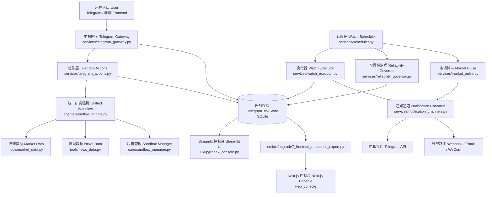
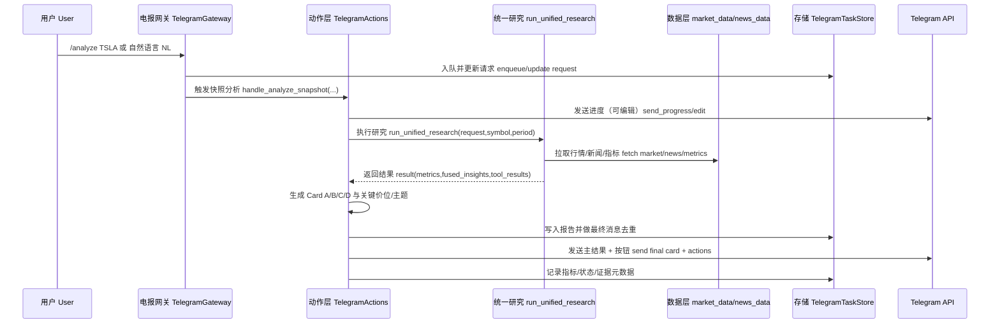

# Alpha-Insight

## 项目简介（What / Why）
Alpha-Insight 是一个“研究 + 监控 + 推送”的量化投研系统：
- 对外能力：支持 Telegram 命令/NL 输入进行快速分析、监控任务创建、告警中心、日报与状态查询。
- 核心目标：把“行情抓取 -> 新闻聚合 -> 指标计算 -> 解释输出 -> 告警分发 -> 降级治理”串成可追踪、可回归、可验收的闭环。

代码依据：
- 统一研究主链路：[agents/workflow_engine.py](agents/workflow_engine.py)
- Telegram 网关与动作层：[services/telegram_gateway.py](services/telegram_gateway.py), [services/telegram_actions.py](services/telegram_actions.py)
- 调度与可靠性治理：[services/scheduler.py](services/scheduler.py), [services/reliability_governor.py](services/reliability_governor.py)

---

## Repo Discovery（目录结构 / 入口 / 依赖）

### 1) 顶层目录（关键）
- `agents/`：研究/扫描/命令路由/NLU。
- `core/`：模型、沙箱策略、运行时配置、连接器抽象、观测与预算。
- `services/`：Telegram 业务动作、存储、调度、通知、脉冲发布、治理。
- `tools/`：行情/新闻/Telegram API 适配器。
- `scripts/`：长轮询网关、webhook 网关、调度器、前端资源导出等运行脚本。
- `ui/`：Streamlit 前端（旧版与升级版控制台）。
- `web_console/`：Next.js 前端（resource-first 路由壳层）。
- `docs/evidence/`：验收证据 JSON。
- `tests/`：pytest 回归与集成测试。

### 2) 关键入口文件
- 统一研究入口：`agents/workflow_engine.py::run_unified_research`
- Telegram 长轮询入口：`scripts/telegram_long_polling_gateway.py`
- Telegram webhook 入口：`scripts/telegram_webhook_gateway.py`
- 监控调度入口：`scripts/telegram_watch_scheduler.py`
- 一键栈脚本：`scripts/telegram_stack.sh`
- Streamlit 研究前端：`ui/llm_frontend.py`
- Streamlit 运行控制台：`ui/upgrade7_console.py`
- Next.js 前端：`web_console/app/(dashboard)/*`

### 3) 外部 API / 数据源 / 集成依赖
- 行情：`yfinance`（`tools/market_data.py::fetch_market_data`）。
- 名称/池子补充：Sina 行情接口、Eastmoney、Wikipedia（`tools/market_data.py` 中 `_fetch_*` / `_refresh_*` / `_http_get`）。
- 新闻：Yahoo Finance RSS + Google News RSS（`tools/news_data.py::fetch_symbol_news_tool_result`）。
- 推送：Telegram Bot API（`tools/telegram.py` + `services/notification_channels.py`）。
- 可选执行沙箱：E2B + Docker/local fallback（`core/sandbox_manager.py`）。

---

## 功能概览（用户视角）
- 快速分析：`/analyze` 或自然语言“分析 TSLA 一个月走势”。
- Snapshot 卡片输出：Card A/B/C/D（区间表现、技术+新闻解释、证据三件套、动作入口）。
- 监控与告警：`/monitor`, `/list`, `/stop`, `/alerts`, `/bulk`。
- 运行与运维：`/status`, `/digest daily`, `/report`。
- 路由与偏好：`/route`, `/webhook`, `/pref`。
- 前端查看：
  - Streamlit（研究/运行看板）
  - Next.js（runs/alerts/evidence/governance 资源视图）

---

## 用户使用手册（Telegram，含自然语言）

### 1) 首次使用（5 分钟）
1. 启动服务：
```bash
bash scripts/telegram_stack.sh restart
bash scripts/telegram_stack.sh status
```
2. 打开 Telegram，进入你的 Bot 会话。
3. 发送 `/start`（展示能力卡）或 `/help`（展示命令清单）。
4. 发送 `/status`，确认系统在线并能返回运行状态。

### 2) 命令版与自然语言版（等价入口）
| 目标 | 命令版 | 自然语言版（NL） | 后端入口 |
|---|---|---|---|
| 快速分析 | `/analyze TSLA` | `分析 TSLA 最近一个月走势并给关键价位` | `TelegramGateway -> TelegramActions.handle_analyze_snapshot` |
| 创建监控 | `/monitor TSLA 1h rsi` | `帮我盯 TSLA，每小时提醒，按 RSI` | `TelegramGateway -> TelegramActions.handle_monitor` |
| 查看任务 | `/list` | `看看我的监控列表` | `TelegramActions.handle_list` |
| 停止任务 | `/stop TSLA` 或 `/stop job-xxxx` | `停止 TSLA 的提醒` | `TelegramActions.handle_stop` |
| 告警中心 | `/alerts failed 20` | `看失败告警前20条` | `TelegramActions.handle_alerts` |
| 报告查询 | `/report <run_id> full` | `给我上次分析的完整报告` | `TelegramActions.handle_report` |
| 日摘要 | `/digest daily` | `给我今天摘要` | `TelegramActions.handle_digest` |
| 路由设置 | `/route set email your@mail.com` | `把告警加到邮箱` | `TelegramActions.handle_route` |

说明：自然语言解析由 `agents/telegram_nlu_planner.py::plan_from_text` 完成，命令解析由 `agents/telegram_command_router.py::parse_telegram_command` 完成。

### 3) 推荐实操流程（新用户）
1. `分析 0700.HK 近30天并给我K线`  
期望输出：Card A/B/C/D + 可点击按钮（K线/新闻/提醒/更多）。
2. `帮我盯 0700.HK 每小时波动提醒`  
期望输出：返回 `job_id`、下次执行时间、策略层级与路由策略。
3. `看看我的监控列表`  
期望输出：活跃任务、最近触发、下次执行。
4. `看下系统状态` 或 `/status`  
期望输出：24h 推送成功率、重试队列、DLQ、降级状态。

### 4) 分析结果怎么读（Card A/B/C/D）
- Card A（区间表现）：近 30 交易日涨跌幅、涨跌额、区间高低、振幅、最大回撤、现价位置。
- Card B（解释层）：技术一句话（含 MA10/MA20、支撑/压力）+ 新闻主题 Top3。
- Card C（证据层）：行情源、新闻覆盖、指标口径、图表说明。
- Card D（动作层）：按钮入口（K线、新闻、提醒、更多）。

### 5) 常见自然语言模板（可直接复制）
- `分析 AAPL 最近3个月，给我关键支撑和压力。`
- `分析 9988.HK，重点看新闻情绪和监管主题。`
- `帮我监控 TSLA，每4小时提醒，走 alert-only。`
- `把提醒改成 email_only。`
- `暂停这个监控任务。`
- `给我最近失败告警。`

---

## Feature Mapping（功能 -> 代码位置）
| 用户功能 | 代码位置（文件 + 关键函数/类） |
|---|---|
| 统一研究流水线（planner -> data -> coder -> executor） | `agents/workflow_engine.py::planner_node/market_data_node/coder_node/executor_node` |
| 计划生成与数据源决策（api/scraper） | `agents/planner_engine.py::plan_tasks/_call_remote_planner/build_fallback_plan` |
| Telegram 命令解析（含 route strategy / strategy tier） | `agents/telegram_command_router.py::parse_telegram_command` |
| Telegram NL 规划/注入检测/槽位澄清 | `agents/telegram_nlu_planner.py::plan_from_text/detect_prompt_injection_risk/extract_clarify_slots` |
| Telegram 分析输出（Card A/B/C/D） | `services/telegram_actions.py::_build_analysis_contract/_technical_sentence_with_levels/_news_theme_lines` |
| Card A OHLC 计算与兜底 | `services/telegram_actions.py::_extract_ohlc_records_from_result/_compute_window_metrics_from_records/_resolve_market_contract_metrics` |
| 监控任务调度与执行 | `services/scheduler.py::TelegramWatchScheduler.run_forever/run_once`, `services/watch_executor.py::execute_due_jobs` |
| 策略分层治理与抑制 | `services/watch_executor.py::resolve_strategy_tier` + `services/telegram_store.py` 抑制状态字段 |
| 降级治理（SLO -> 状态切换） | `services/reliability_governor.py::ReliabilityGovernor.reconcile` |
| 脉冲发布（订阅 + 去重分发） | `services/market_pulse.py::MarketPulsePublisher.publish_due` |
| 新闻主题化/情绪门槛 | `services/news_digest.py::build_news_digest/format_top_news_lines/format_cluster_lines` |
| 多通道路由（telegram/email/wecom/webhook） | `services/notification_channels.py::MultiChannelNotifier`, `scripts/telegram_watch_scheduler.py::WebhookTextSender` |
| Typed 资源读取（前端） | `ui/typed_resource_client.py::FrontendResourceClient`, `web_console/lib/contracts.ts` |

---

## 架构与模块（开发者视角）



---

## 数据流图（一次分析请求链路）



---

## 数据源与证据口径（行情 / 新闻 / 指标）

### 1) 行情口径（Card A 依赖）
来源与字段：
- 主来源：`yfinance`（`tools/market_data.py::fetch_market_data`）。
- 数据结构：OHLC 序列在 `DataBundle.records`（`core/models.py::DataBundle`）。
- 关键字段（Card A）：`start_close`, `end_close`, `pct_change`, `abs_change`, `high`, `low`, `amplitude`, `max_drawdown`, `ratio(position)`。
- 计算实现：`services/telegram_actions.py::_compute_window_metrics_from_records`。

### 2) 新闻口径
- 拉取：`tools/news_data.py::fetch_symbol_news_tool_result`。
- 统一字段：`title/link(publisher/source/published_at/summary)`。
- 主题化与情绪：`services/news_digest.py::build_news_digest`。
- 情绪输出门槛：`N < 5` 时显示样本不足，不输出“玄学分”。

### 3) 技术指标口径
- 主要输出：`RSI14`, `MA10`, `MA20`, `support`, `resistance`。
- 文案生成：`services/telegram_actions.py::_technical_sentence_with_levels`。
- 指标说明在结果卡中固定展示：`RSI14(1d)、MA10(1d)、MA20(1d)`。

### 4) 证据文件（可复核）
- 目录：`docs/evidence/`
- 已有示例：`upgrade8_p1_*.json`, `upgrade8_p2_*.json`, `upgrade8_p2_regression_gate.json`。
- Next 前端资源快照：`docs/evidence/upgrade7_frontend_resources.json`（由 `scripts/upgrade7_frontend_resources_export.py` 生成）。

---

## 快速开始（安装 / 配置 / 运行）

### 1) Python 环境
```bash
cd /home/kkk/Project/Alpha-Insight
python -m venv .venv
source .venv/bin/activate
pip install -r requirements-dev.txt
```

### 2) 环境变量
复制并编辑：
```bash
cp .env.example .env
```
重点配置键（代码中有直接读取）：
- LLM：`OPENAI_API_KEY`, `OPENAI_API_BASE`, `OPENAI_MODEL_NAME`, `TEMPERATURE`, `ENABLE_LOCAL_FALLBACK`
- Telegram：`TELEGRAM_BOT_TOKEN`, `TELEGRAM_ACCESS_MODE`, `TELEGRAM_ALLOWED_CHAT_IDS`, `TELEGRAM_BLOCKED_CHAT_IDS`
- 网关/调度：`TELEGRAM_GATEWAY_DB`, `TELEGRAM_*_TIMEOUT_SECONDS`, `TELEGRAM_*_CONCURRENCY`
- 灰度：`TELEGRAM_GRAY_RELEASE_ENABLED`

### 3) 启动 Telegram 全链路（推荐）
```bash
bash scripts/telegram_stack.sh restart
bash scripts/telegram_stack.sh status
```
日志默认：`/tmp/telegram_gateway.log`, `/tmp/telegram_scheduler.log`。

### 4) 启动 webhook 模式（可选）
```bash
python scripts/telegram_webhook_gateway.py --host 0.0.0.0 --port 8081 --path /telegram/webhook
python scripts/telegram_watch_scheduler.py --poll-interval-seconds 1 --batch-size 20
```

### 5) 启动前端
- Streamlit（研究前端）：
```bash
streamlit run ui/llm_frontend.py --server.port 8501
```
- Streamlit（Upgrade7 控制台）：
```bash
streamlit run ui/upgrade7_console.py --server.port 8502
```
- Next.js 控制台：
```bash
python scripts/upgrade7_frontend_resources_export.py
cd web_console
npm install
npm run dev
```
默认地址：`http://localhost:8600`（自动跳转 `/runs`）。

---

## Runtime & Ops（调度 / 监控 / 降级 / 重试）

### 1) 调度与脉冲
- 主调度循环：`services/scheduler.py::TelegramWatchScheduler.run_forever`。
- 脉冲发布：`services/market_pulse.py::MarketPulsePublisher.publish_due`。
- 脚本级扫描：`scripts/hourly_watchlist_scan.py`（支持 `--once` 便于 cron）。

### 2) 重试与容错
- 连接器重试：`core/connectors.py::BaseConnector.call` + `core/runtime_config.py` 的 retry 配置层。
- 通知重试/DLQ：`services/watch_executor.py` + `services/telegram_store.py`（`notifications`/重试队列）。
- 沙箱回退：`core/sandbox_manager.py::_should_fallback_to_local_process`（包括 Docker 缺失/权限问题时 local fallback）。

### 3) 降级治理
- 触发条件：推送成功率、分析 p95、DLQ 趋势。
- 执行器：`services/reliability_governor.py::ReliabilityGovernor`。
- 典型状态：`no_monitor_push`, `summary_mode`, `disable_critical_research`, `chart_text_only`, `nl_command_hint_mode`。

### 4) 运行状态观测
- `/status` 输出由 `services/telegram_actions.py::handle_status` 生成。
- 指标与事件持久化：`services/telegram_store.py` 表 `metric_events`, `degradation_states`, `degradation_events`。

---

## 常用命令（测试 / 运行 / 验收）

### 测试
```bash
pytest -q
pytest -q tests/test_telegram_phase_b.py tests/test_telegram_phase_d.py tests/test_market_pulse.py
```

### Telegram 栈
```bash
bash scripts/telegram_stack.sh start
bash scripts/telegram_stack.sh restart
bash scripts/telegram_stack.sh status
```

### 资源导出（Next 控制台数据源）
```bash
python scripts/upgrade7_frontend_resources_export.py
```

### Docker Compose（可选）
```bash
docker compose up dev
# 或
 docker compose -f docker-compose.telegram.yml up -d
```

---

## 目录结构导览
```text
Alpha-Insight/
├── agents/                  # 统一研究、扫描、命令/NLU
├── core/                    # 模型、策略、运行时配置、沙箱、连接器
├── services/                # Telegram 动作、存储、调度、通知、治理
├── tools/                   # 市场数据/新闻/Telegram API 适配
├── scripts/                 # 启停脚本、网关入口、调度入口、资源导出
├── ui/                      # Streamlit 前端
├── web_console/             # Next.js 前端（runs/alerts/evidence/governance）
├── docs/evidence/           # 验收与回归证据
└── tests/                   # pytest 测试
```

---

## 关键流程（Telegram 一次“分析”请求时序）
1. 用户输入命令或自然语言，`TelegramGateway` 解析命令/NLU（含注入风险检测）。
2. 网关写入 `bot_updates` / `analysis_requests`，并调用 `TelegramActions`。
3. `TelegramActions` 发送进度消息（可 edit），进入 `run_unified_research`。
4. 研究链路返回行情/新闻/指标，动作层计算 Card A/B/C/D。
5. 写入 `analysis_reports` 与请求状态，执行 final-message 去重。
6. 发送结果消息（含按钮），后续按钮可触发新闻详单、聚类、重试等。

相关代码：
- `services/telegram_gateway.py::process_enqueued_update`
- `services/telegram_actions.py::handle_analyze_snapshot/_run_analysis_request`
- `services/telegram_store.py::claim_final_message_dispatch/mark_final_message_dispatched`

---

## 故障排查（常见错误 / 降级模式 / /status 解读）

### 1) `Unified research failed: [Errno 2] No such file or directory: 'docker'`
- 含义：Docker 二进制缺失或不可调用。
- 代码路径：`core/sandbox_manager.py::_should_fallback_to_local_process`。
- 处理：安装 Docker，或确认 local fallback 已启用并通过测试 `tests/test_sandbox_manager.py`。

### 2) Card A 出现“数据不足”
- 触发：缺少近 30 日 OHLC 序列（不是单点 close）。
- 代码路径：`services/telegram_actions.py::_compute_window_metrics_from_records`。
- 处理：检查 `tool_results.market_data.raw.records` 是否完整。

### 3) 告警不推送
- 查看 `/status` 中：
  - `24h投递成功率`
  - `重试队列深度`
  - `DLQ`
  - `监控推送降级中`
- 相关治理：`services/reliability_governor.py`。

### 4) Next.js 页面有壳无数据
- 当前 Next 控制台读取 `docs/evidence/upgrade7_frontend_resources.json`，不是直连 SQLite。
- 先运行：`python scripts/upgrade7_frontend_resources_export.py`。

---

## 安全与合规（爬虫 / RSS / 展示边界）
- 代码执行防护：`core/sandbox_policy.py` + `core/guardrails.py::validate_sandbox_code`。
- NL 安全：`agents/telegram_nlu_planner.py::detect_prompt_injection_risk`。
- 展示脱敏：`services/news_digest.py::redact_user_visible_payload`；`telegram_actions` 对内部关键字做用户文案替换。
- 内容边界：Telegram 帮助文案已明确“仅用于研究与提醒，不支持自动交易”（`services/telegram_actions.py::handle_help`）。

⚠️ Unknown/Needs verify：
- 爬虫/RSS 的 robots 与站点条款合规策略未在仓库看到统一策略文件。
- 建议核查：是否存在独立合规说明（例如 `docs/compliance*.md`）或运维侧白名单策略。

---

## Roadmap / TODO（基于代码现状推断）
1. Next 控制台数据链路升级：从“离线 JSON 导出”升级到“实时 typed API / OpenAPI contract”。
2. 统一配置文档化：把 Telegram 与 runtime config 键形成单一配置手册（当前分散在脚本与代码）。
3. 增强观测面板：把 `metric_events`/`degradation_events` 直接可视化，减少人工查库。
4. 完整合规文档：补爬虫源条款、采样频率、失败重试上限与缓存策略说明。
5. 端到端回归套件：补 webhook + scheduler + pulse 的可重复 smoke（非破坏性）。

---

## ⚠️ Unknown / Needs verify
1. `docker-compose.telegram.yml` 启动了 `telegram-db(Postgres)`，但当前 Python 存储实现是 SQLite（`services/telegram_store.py`）。
   - 需要确认：是否存在未纳入当前分支的 Postgres store 适配层。
2. Email/WeCom 通过 webhook 发送时的对端协议只在 `scripts/telegram_watch_scheduler.py::WebhookTextSender` 中有最小约定（`{"target","text"}`），缺正式接口文档。
3. 生产进程托管策略（systemd/supervisor/k8s）未在仓库给出。

---

## 分析依据（本 README 编写时重点核查文件）
- 运行与主链路：
  - `agents/workflow_engine.py`
  - `agents/planner_engine.py`
  - `services/telegram_gateway.py`
  - `services/telegram_actions.py`
  - `services/scheduler.py`
  - `services/watch_executor.py`
  - `services/reliability_governor.py`
  - `services/market_pulse.py`
  - `services/telegram_store.py`
- 数据与连接器：
  - `tools/market_data.py`
  - `tools/news_data.py`
  - `services/news_digest.py`
  - `core/connectors.py`
  - `core/runtime_config.py`
- 前端与资源：
  - `ui/upgrade7_console.py`
  - `ui/typed_resource_client.py`
  - `web_console/app/(dashboard)/*`
  - `web_console/lib/*`
- 启动脚本与配置：
  - `scripts/telegram_stack.sh`
  - `scripts/telegram_long_polling_gateway.py`
  - `scripts/telegram_webhook_gateway.py`
  - `scripts/telegram_watch_scheduler.py`
  - `.env.example`, `requirements*.txt`
