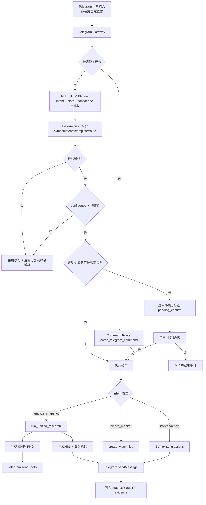

1) 主流产品的“自然语言投研代理（Telegram/Chat）”流程共性（结合当前项目，归纳截至 2026-02-27）

把“在 Telegram 里像聊天一样下发任务”拆开看，生产系统通常采用同一套五层架构：

接入层（Bot Inbound）：
- Telegram Bot API 接入消息（Long Polling 或 Webhook），update_id 幂等落库。
- 命令（`/xxx`）与自然语言（非 `/` 文本）双入口并存。

理解层（NLU + LLM Planner）：
- 先做规则/正则兜底，再由 LLM 输出结构化 JSON（intent/slots/confidence/risk）。
- LLM 不是直接执行器，而是“任务规划器（planner）”。

执行层（Orchestrator）：
- 根据 intent 调用既有能力：统一研究、监控创建、任务查询、报告拉取。
- 高风险操作（创建监控、批量修改）必须二次确认。

结果层（Artifacts + Response）：
- 文本摘要：中文主导，术语英文括注。
- 图形产物：K 线图（candlestick）/指标图，作为图片回传 Telegram。

治理层（Reliability + Audit）：
- 全链路指标、失败重试、降级开关、审计事件、可回放证据。
- NL 请求独立落库、去重、状态机、DoD 幂等验证。

结论：
- “聊天式任务代理”不是替代现有命令，而是新增一个 NL fallback 入口。
- 你的仓库已经具备执行内核，升级重点是“理解与编排治理”，不是重写分析引擎。

2) Alpha-Insight 对应的业务流程图（升级3：NL + LLM + 图文回传）

3) Alpha-Insight 升级3计划书（生产级自然语言任务代理）

0. 计划目标（2026 Q2）

把 Alpha-Insight 从“命令式 Telegram 助手”升级为“自然语言任务代理”：
- 用户可用聊天方式下发分析与监控任务。
- 系统可返回 K 线图 + LLM 综合分析（含新闻融合）。
- 保持原有命令兼容，避免破坏生产稳定性。

1. 需求合理性分析（为什么现在做）

业务合理性：
- 使用门槛下降：用户无需记忆完整命令格式。
- 转化与留存提升：聊天式交互比命令式更贴近日常行为。
- 价值升级：从“查询工具”走向“任务代理”。

技术合理性（结合当前仓库）：
- 已有统一研究引擎：`agents/workflow_engine.py::run_unified_research`
- 已有新闻融合：`agents/market_news_engine.py`
- 已有 Telegram 网关与动作：`services/telegram_gateway.py`、`services/telegram_actions.py`
- 已有图片发送能力：`tools/telegram.py::send_photo`
- 已有监控与告警链路：`services/watch_executor.py`、`agents/scanner_engine.py`

核心缺口：
- 缺少 NL fallback 入口（非 `/` 文本目前会报 unsupported）。
- 缺少 LLM 结构化意图规划层。
- 缺少图表产物到 Telegram 主链路的统一编排。
- 缺少“高风险二次确认”的对话状态机。

2. To-Be 总体架构原则（生产标准）

- 命令优先：`/` 命令行为保持不变，NL 为增量入口。
- 双通道理解：规则解析优先，LLM 解析补充，输出统一 schema。
- 先确认后执行：高风险动作必须显式确认。
- 强校验：LLM 输出必须经 symbol/interval/template/route 白名单校验。
- 强校验：LLM 输出必须经 deterministic 校验清单（symbol、interval、template、route_strategy）。
- 可降级：LLM 不可用时，系统退化为命令提示，不影响命令链路。
- 可追溯：每次 NL 解析与执行结果写审计与指标。
- 高风险判定只由规则引擎决定，LLM 仅提供建议，不拥有执行裁决权。

2.1 强制修改清单（按优先级）

P0（必须）：
1. NL 请求落库与幂等：
   - 新增/复用表：`nl_requests(request_id unique, chat_id, raw_text, normalized_text, parsed_intent, slots, confidence, risk, status, created_at, last_error, dedupe_key)`。
   - 去重键基础版：`dedupe_key = chat_id + normalized_text + bucket_ts`（默认 30s）。
   - 去重键兜底版（按 intent 拼 slots 指纹）：
     - `create_monitor`：`chat_id + symbol + interval + template + bucket_ts`
     - `analyze_snapshot`：`chat_id + symbol + period + interval + need_chart + need_news + bucket_ts`
   - 推荐双键策略：`text_dedupe_key` + `intent_dedupe_key` 同时命中才视为重复，降低误伤/漏判。
   - DoD：同一 dedupe_key 不得执行两次 `create_monitor` 或 `analyze_snapshot`。
2. 高风险规则强制：
   - 必须确认：`create_monitor`、`stop_job`、`bulk_change`。
   - 默认不确认：`analyze_snapshot`、`list_jobs`、`report`。
   - 只要命中高风险 intent，必须 `pending_confirm`，不看 LLM 自评风险。
3. 澄清硬边界：
   - 最多 1 问，仅允许澄清 slots：`symbol/period/interval/template/market`。
   - 澄清后仍不完整：拒绝执行 + 返回可复制命令模板。
   - 指标：`nl_clarify_asked_total`、`nl_clarify_resolved_rate`。
4. Deterministic 校验清单：
   - `symbol`：normalize + 白名单模式。
   - `interval`：白名单（如 1m-24h 或系统允许集）。
   - `template`：白名单（volatility|price|rsi）。
   - `route_strategy`：白名单（telegram_only|webhook_only|dual_channel）。
   - 校验失败统一拒绝执行，记录审计 explain。
5. 确认态唯一性与绑定规则：
   - 同一 `chat_id` 同一时刻最多 1 个 `pending_confirm`（N=1）。
   - v1 交互硬规则：必须优先使用 inline keyboard `callback_data`（`yes|no + request_id`）做确认。
   - reply_to/短码解析仅作降级兼容（客户端不支持按钮时）。
   - 用户回复“是/否”必须绑定目标 `request_id`：
     - 确认消息必须包含 `request_id` 短码（或 callback payload）。
     - 无法解析绑定时不执行，返回“请回复指定确认消息”。
   - 验收：并发确认场景下，不会将“是”应用到错误请求。
6. pending_confirm 冲突策略（写死）：
   - 当 chat 已有 `pending_confirm`，新 NL 请求默认策略：拒绝并提示“请先确认或取消上一个请求（附 request_id 短码）”。
   - 可选策略（v2）：排队 `queued`，但 v1 不启用，避免状态机分叉。
7. 确认超时与取消规则（写死）：
   - `pending_confirm` 超时后收到“是/否”一律无效，返回“请求已过期，请重新发起”。
   - v1 必须提供取消路径：`/cancel` 或 “取消按钮（callback）”。
8. NL 与命令并发优先级（v1）：
   - 当同一 chat 处于 `executing`（例如正在跑 unified research）时，新 NL 请求不并行执行。
   - 统一回包：“正在执行，请稍后或使用 /status 查询”。
   - 目标：限制 LLM/沙箱并发爆量，保持体验可预测。
9. 解析失败审计最小集合（硬约束）：
   - `raw_text_hash`（不存原文，默认存 hash）
   - `intent_candidate`
   - `reject_reason`（`low_confidence|invalid_slot|unsafe_route|clarify_failed`）
   - `confidence`

P1（强烈建议）：
1. 图表链路统一：
   - 优先复用 `ResearchResult/Sandbox Artifacts` 产物。
   - `telegram_chart_service` 仅做 artifact 获取 + resize/compress + `sendPhoto`。
   - 禁止 chart_service 另起一套行情拉取/指标计算逻辑；只消费统一研究产物或统一 data bundle。
   - 失败降级：artifact 缺失/超大/渲染失败 -> 只发文本摘要。
   - 图片 payload 硬上限（v1）：例如 `<= 5MB`（或实施时定为 10MB）；超限必须自动压缩或降级文本。
2. NLU schema 补字段：
   - `needs_confirm`（最终由规则引擎覆盖）
   - `normalized_request`（用于审计与去重）
   - `action_version`（schema 演进版本，如 `v1`/`v2`，用于回放与证据追溯）
   - 兼容策略：`v2` 输出必须兼容 `v1`（新增字段必须 optional，不破坏旧回放）。
3. 指标体系对齐命令链路并进入 evidence：
   - `nl_intent_total/success/reject/fallback_help`
   - `nl_confirm_timeout_count`
   - `llm_parse_latency_p95`、`llm_parse_fail_rate`
   - `nl_dedupe_suppressed_count`
   - `chart_render_fail_rate`、`chart_payload_bytes_p95`

P2（可选加分）：
1. 统一结构化回复模板（中文主导 + 英文括注）：
   - 标题行 + 关键指标（bullet）+ 风险提示 + `run_id` + 下一步命令。
2. 明确实时性边界：
   - v1：分钟/小时聚合，不承诺 tick 级实时。
   - v2：接 WebSocket 数据源后再升级实时性。
3. 澄清问题白名单模板：
   - “你指的是 `<symbol_a>` 还是 `<symbol_b>`？”
   - “周期是 `一周/一月/三月` 哪一个？”
   - “间隔是 `5m/1h/1d` 哪一个？”
   - 超出模板不提问，直接拒绝并返回命令模板，控制成本与行为漂移。

3. 路线图（生产版：A/B/C/D）

阶段 A（P0，最小可用）：NLU 入口 + 安全执行骨架  
目标：自然语言请求可入链路，但默认安全、可拒绝、可追溯。

- A1. Gateway 增加 NL fallback（最小侵入）  
  文件：`services/telegram_gateway.py`  
  完成定义：  
  1. 文本以 `/` 开头时，保持现有命令逻辑不变。  
  2. 非 `/` 文本进入 `telegram_nlu_planner`。  
  3. 同 chat 处于 `executing` 时，新 NL 请求不并行执行，返回“正在执行，请稍后或 /status”。  

- A2. NLU 输出与 deterministic 校验  
  文件：`agents/telegram_nlu_planner.py`（新增）  
  完成定义：  
  1. v1 支持 `create_monitor`（后续 B 阶段接 `analyze_snapshot`）。  
  2. 输出 schema：`intent/slots/confidence/risk_level/needs_confirm/normalized_request/action_version/explain`。  
  3. 执行前强制校验 `symbol/interval/template/route_strategy` 白名单。  
  4. 低置信度或校验失败统一拒绝执行，返回可复制命令模板。  

- A3. NL 落库、去重、审计  
  文件：`services/telegram_store.py` + `services/telegram_gateway.py`  
  完成定义：  
  1. 新增 `nl_requests` 状态机：`queued/clarify/pending_confirm/executing/completed/rejected/failed`。  
  2. 去重双键：  
     - `text_dedupe_key = chat_id + normalized_text + bucket_ts(30s)`  
     - `intent_dedupe_key = chat_id + intent_slots_fingerprint + bucket_ts`  
  3. intent 级判重策略：  
     - `create_monitor`：`intent_dedupe_key` 命中即可判重（优先防重复建监控）。  
     - `analyze_snapshot`：双键都命中才判重（降低误伤）。  
  4. 审计最小字段：`raw_text_hash/intent_candidate/reject_reason/confidence`。  

- A4. 高风险确认机制（P0 硬规则）  
  文件：`services/telegram_gateway.py` + `services/telegram_store.py`  
  完成定义：  
  1. 高风险由规则引擎判定：`create_monitor/stop_job/bulk_change` 必须确认。  
  2. 同一 `chat_id` 同时最多 1 个 `pending_confirm`。  
  3. v1 确认交互主路径：inline keyboard `callback_data`（`yes|no + request_id`）；reply_to/短码仅降级。  
  4. 超时（如 5 分钟）后确认一律无效，返回“已过期，请重新发起”。  
  5. 必须提供 `/cancel` 或取消按钮。  
  6. chat 已有 `pending_confirm` 时，新请求默认拒绝并提示先处理上一个。  

- A5. 澄清边界（最多一问）  
  完成定义：  
  1. 仅允许澄清 `symbol/period/interval/template/market`。  
  2. 仅允许白名单问题模板，不允许自由追问。  
  3. 澄清后仍不完整则拒绝执行并返回命令模板。  

A 验收：  
1. “帮我盯 TSLA 每小时”可创建任务（确认后生效）。  
2. 高风险请求未确认不执行。  
3. 并发确认不串单（“是/否”只作用绑定 request_id）。  
4. 同 dedupe 条件不重复执行。  
5. `/monitor` 现有行为不回归。  

阶段 B（P0/P1）：自然语言分析 + 图文回传  
目标：支持“我要看腾讯一个月涨跌，发 K 线图和综合分析”。

- B1. 新增 `analyze_snapshot` 意图  
  文件：`agents/telegram_nlu_planner.py`  
  完成定义：  
  1. 识别 `symbol/period/interval/need_chart/need_news`。  
  2. ticker 别名映射：腾讯/Tencent -> `0700.HK`（默认，可扩展 `TCEHY`）。  
  3. 保持 A 阶段 P0 校验/去重/并发规则完全继承。  

- B2. 图表链路接入（统一口径）  
  文件：`services/telegram_chart_service.py`（新增）  
  完成定义：  
  1. 优先读取 `run_unified_research` 产出的 chart artifact（PNG）。  
  2. 禁止 chart_service 自建行情拉取/指标计算逻辑，仅消费统一 artifact/data bundle。  
  3. 图片 payload 设置硬上限（如 `<=5MB`，实现可定 10MB），超限自动压缩或降级文本。  
  4. artifact 缺失/渲染失败不阻断主流程，降级为文本摘要。  

- B3. Telegram 结构化回包  
  文件：`services/telegram_actions.py`  
  完成定义：  
  1. 图文回包顺序固定：标题 -> 关键指标 -> 一句话结论/风险 -> run_id -> 下一步命令。  
  2. 文案中文主导，术语括注英文。  

B 验收：  
1. “腾讯一个月涨跌”可返回 run_id 与文本摘要。  
2. 请求图表时可回传 PNG；超限或失败时自动降级文本。  
3. 指标可观测：`chart_render_fail_rate`、`chart_payload_bytes_p95`。  

阶段 C（P1）：生产治理（可靠性/风控/可观测）  
目标：从能用提升到可运营、可回放。

- C1. LLM 与执行治理  
  1. LLM 超时/重试/熔断/速率限制。  
  2. chat 级配额与并发控制（避免爆量）。  

- C2. 安全与合规  
  1. Prompt 注入防护，用户输入与系统指令隔离。  
  2. 审计优先存 hash 与分类字段，减少 PII 暴露。  

- C3. 指标与降级  
  指标：  
  1. `nl_intent_total/success/reject/fallback_help`  
  2. `nl_confirm_timeout_count`  
  3. `llm_parse_latency_p95`、`llm_parse_fail_rate`  
  4. `nl_dedupe_suppressed_count`  
  5. `nl_clarify_asked_total`、`nl_clarify_resolved_rate`  
  6. `chart_render_fail_rate`、`chart_payload_bytes_p95`  
  降级：  
  1. LLM 异常率高 -> 自动降级“命令提示模式”。  
  2. 图表失败率高 -> 自动降级文本摘要。  

C 验收：  
1. 24h 运行稳定，命令链路不受 NL 抖动影响。  
2. 关键指标可进 run_report 且与命令链路同口径对齐。  
3. 低置信度/校验失败可通过审计字段完整追踪。  

阶段 D（P2）：任务代理化扩展（多意图与版本演进）  
目标：在保持 P0 安全约束前提下，扩展多轮规划能力。

- D1. 多意图支持  
  1. `create_monitor`  
  2. `analyze_snapshot`  
  3. `list_jobs`  
  4. `stop_job`  
  5. `daily_digest`  

- D2. 规划与状态演进  
  1. LLM 输出 `plan steps`，Orchestrator 按步骤执行。  
  2. 输出包含 `action_version`，并保持 v2 对 v1 兼容（新增字段 optional）。  
  3. evidence 记录 `schema_version + action_version`，保证回放可追溯。  

- D3. 体验稳定性  
  1. 继续执行“最多一问澄清”与“高风险必确认”硬规则。  
  2. 结果模板结构化，减少风格漂移。  

D 验收：  
1. 多轮任务可稳定执行且步骤可追踪。  
2. 版本升级后旧 evidence 仍可回放。  
3. 全流程仍满足 A-C 的 P0/P1 安全约束。  

4. 改动规模评估（针对当前仓库）

预计新增/改动：
- 新增：
  - `agents/telegram_nlu_planner.py`
  - `services/telegram_chart_service.py`
  - （可选）`services/telegram_confirmation_store.py`
- 改动：
  - `services/telegram_gateway.py`
  - `services/telegram_actions.py`
  - `agents/telegram_command_router.py`（仅兼容辅助，不改原命令语义）
  - `tests/test_telegram_phase_d.py`（新增 NL 与图文回包用例）

工作量（生产版）：
- 代码：约 800-1600 行（分阶段）
- 测试：约 15-30 个新增/调整用例
- 工期：
  1. MVP（A+B 基础）：3-5 天
  2. 生产治理（C）：3-5 天
  3. 扩展（D）：1-2 周

5. 持续质量门禁（生产版）

- 单测：
  1. NLU schema 校验
  2. 低置信度拒绝
  3. 二次确认状态机
  4. 命令兼容回归

- 集成：
  1. Telegram Long Polling 真实链路
  2. `analyze + chart + message` 端到端
  3. `create_monitor` 自然语言端到端

- 验收证据：
- 验收证据：
 - 验收证据：
  1. `docs/evidence/telegram_nl_mvp_run_report.json`
  2. `docs/evidence/telegram_nl_chart_acceptance.json`
  3. `docs/evidence/telegram_command_compat_regression.json`
  4. `docs/evidence/telegram_nl_dedupe_confirm_report.json`
  5. `docs/evidence/telegram_nl_action_version_trace.json`
  6. `docs/evidence/telegram_nl_confirm_binding_report.json`

- 硬门禁：
 - 硬门禁：
 - 硬门禁：
  1. `pytest -q` 全量通过
  2. 命令链路可用性不低于升级前基线
  3. NL 高风险动作“未确认不执行”
  4. 同一 dedupe_key 无重复执行（有 SQL/报告证据）
  5. 澄清最多 1 问，超限必须拒绝执行
  6. 并发确认不串单（有 request_id 绑定证据）
  7. callback 优先确认链路通过；reply_to/短码仅作为降级链路
  8. 图片 payload 超限时自动压缩或降级文本，不得静默失败

6. 同类能力借鉴与本项目映射

- 命令与自然语言并存：保留命令确定性，NL 提升可用性。
- 结构化输出优先：LLM 只负责“理解和规划”，执行仍走确定性 action。
- 图文分层回包：图片承载可视化，文字承载结论与风险。

对 Alpha-Insight 的具体建议：
1. 先做 A 阶段保证安全与最小可用。
2. 再做 B 阶段形成“腾讯一月涨跌 + K线图 + 综合分析”的标杆体验。
3. C 阶段补齐生产治理，再考虑 D 阶段扩展多意图规划。
4. 最小化升级原则：仅改 Telegram 网关/动作/存储边界，不改既有 UI（Planner Console/Streamlit）交互与渲染逻辑。

7. 升级3的执行约束（避免乱改）

- 只在 Telegram 边界层增量改造，不触碰核心研究引擎逻辑。
- `/analyze`、`/monitor`、`/list`、`/stop` 的原行为保持兼容。
- 任何 LLM 输出都必须经过 deterministic 校验后再执行。
- 文案统一中文主导，术语括注英文（例：置信度（confidence））。
- 每阶段落地后必须沉淀 evidence，再进入下一阶段。
- v1 实时性边界：分钟/小时聚合，不承诺 tick 级实时。
- v2 扩展边界：接入 WebSocket 数据源后再升级实时性能力。
- 回复模板结构化输出，避免自由发挥导致风格漂移。
- v1 确认态边界：每 chat 仅 1 个 pending_confirm，必须 request_id 绑定确认。
- v1 最小化升级边界：仅新增 Telegram NL 能力，不改动现有 UI 页面结构、样式和交互路径。

附：升级3首批 DoD（Definition of Done）

1. 用户输入“帮我盯 TSLA 每小时” -> 系统确认 -> 创建任务成功。
2. 用户输入“我要看腾讯一个月涨跌，发K线图和综合分析” -> 返回图片+文本。
3. 用户输入模糊/高歧义语句 -> 不执行，给可复制命令。
4. 真实 Telegram 验收 + 全量 pytest 通过 + 证据入库。
5. 同一 dedupe_key 多次输入不会重复执行 create/analyze。
6. 高风险 intent 一律进入确认流程，不受 LLM 风险字段影响。
7. 澄清最多一问，未补齐槽位则拒绝执行并给命令模板。
8. 并发确认场景下，“是/否”不会作用到错误 request_id。
9. evidence 中可追溯 `action_version`。
10. callback 确认链路、超时失效、/cancel 取消路径均有真实链路证据。

D阶段（P2）DoD 强约束清单（可直接作为验收门禁）

仓库与流程前置（必须）
1. 已执行并展示：
   - BD_ISSUE_PREFIX=Alpha-Insight bd --no-db ready
   - claim Alpha-Insight-127（或新建并claim）
   - git status --short --branch
2. 明确列出并承诺不提交用户脏改文件：
   - .env
   - AGENTS.md
   - agents/telegram_command_router.py
   - services/telegram_actions.py
   - services/watch_executor.py
   - antigravity-awesome-skills
   - 1.md
   - storage/
   - 升级3.md

功能DoD（D1 多意图）
3. NL 能稳定识别并执行以下意图（至少各 1 条测试）：
   - create_monitor
   - analyze_snapshot
   - list_jobs
   - stop_job
   - daily_digest
4. 命令链路兼容不回归：
   - /analyze /monitor /list /stop /report /digest 现有行为保持
5. 高风险硬规则不被破坏：
   - stop_job / bulk_change / create_monitor 命中高风险时必须 pending_confirm
   - 未确认不得执行

功能DoD（D2 规划与版本演进）
6. NLU/Planner 输出支持 plan steps（可最小实现），Orchestrator 按步骤执行并可追踪步骤状态
7. action_version 演进到 v2（或等效版本升级），同时满足：
   - v2 对 v1 向后兼容
   - 新增字段 optional
   - 旧回放不报错
8. evidence/run_report 中可追溯：
   - schema_version
   - action_version
   - request_id 与执行结果映射

功能DoD（D3 体验稳定）
9. 澄清机制仍满足 P0 约束：
   - 最多一问
   - 仅白名单 slots（symbol/period/interval/template/market）
   - 失败返回可复制命令模板
10. 确认绑定仍满足 P0 约束：
   - callback_data 优先
   - yes/no 必须绑定 request_id
   - 并发确认不串单
11. 输出模板结构化且稳定：
   - 标题
   - 关键指标
   - 一句话结论/风险
   - run_id/request_id
   - 下一步命令

治理与可观测DoD（继承C，必须保持）
12. C阶段指标不丢失且值可产出：
   - nl_intent_total/success/reject/fallback_help
   - nl_confirm_timeout_count
   - llm_parse_latency_p95 / llm_parse_fail_rate
   - nl_dedupe_suppressed_count
   - nl_clarify_asked_total / nl_clarify_resolved_rate
   - chart_render_fail_rate / chart_payload_bytes_p95
13. 自动降级仍有效：
   - LLM异常高 -> 命令提示模式
   - 图表失败率高 -> 文本模式

测试门禁（必须全部通过）
14. 先跑分阶段：
   - pytest -q tests/test_telegram_phase_a.py tests/test_telegram_phase_b.py tests/test_telegram_phase_c.py tests/test_telegram_phase_d.py
15. 再跑全量：
   - pytest -q
16. 输出必须包含：
   - 每条命令
   - 通过数（例如 41 passed / 90 passed）
   - 若有失败，必须修复后重跑直至通过

交付与收尾DoD（必须）
17. issue流转完整：
   - close 已完成 issue（Alpha-Insight-127）
   - create follow-up（如有遗留）
18. 仅提交本轮D阶段文件：
   - git add 明确文件列表（禁止 `git add .`）
19. push 落地完整：
   - git commit
   - git pull --rebase --autostash
   - BD_ISSUE_PREFIX=Alpha-Insight bd --no-db sync
   - git push
   - git status 显示 main 与 origin/main 同步（允许工作区有未提交脏改，但不得是本轮遗漏）
20. 最终报告必须按以下结构：
   1) 改动文件列表与核心实现点
   2) 测试结果（命令+通过情况）
   3) D阶段验收项逐条结论
   4) 收尾1~7每条状态（通过/不通过+证据）

禁止事项（硬约束）
21. 不改 UI（Planner Console/Streamlit）
22. 不改 workflow/scanner 核心分析内核业务逻辑
23. 不回滚、不覆盖用户本地脏改
24. 不得跳过 push，不得以“ready to push”结束
