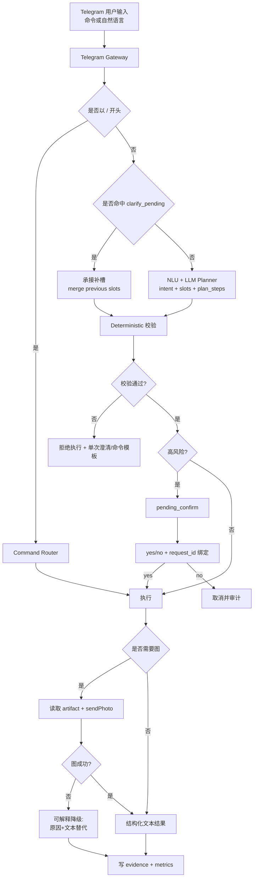

1) 主流产品的“对话连续 + 证据化投研代理（Telegram/Chat）”流程共性（结合当前项目，归纳截至 2026-02-27）

把“会聊天的投研代理”拆开看，主流生产系统通常采用同一套六层架构：

接入层（Bot Inbound）：
- Telegram Bot API 接入消息（Long Polling 或 Webhook），update_id 幂等落库。
- 命令（`/xxx`）与自然语言（非 `/` 文本）双入口并存。

会话层（Session + Clarify Memory）：
- 保存短时会话上下文（clarify_pending / last_intent / last_slots）。
- 用户二次补充（如“腾讯的”）可承接上一问，不要求重述完整请求。

理解层（NLU + LLM Planner）：
- 规则/正则兜底 + LLM 结构化输出（intent/slots/confidence/plan_steps）。
- LLM 仅做“理解与规划”，不直接执行。

执行层（Orchestrator）：
- 根据 intent 调用既有能力：研究分析、监控创建、任务管理、报告摘要。
- 高风险操作必须二次确认。

结果层（Artifacts + Structured Response）：
- 文本固定模板：标题/关键指标/结论风险/request_id|run_id/下一步。
- 图形产物：K 线图/指标图；失败时必须“可解释降级”（说明原因+替代内容）。

治理层（Reliability + Audit + Evidence）：
- 全链路指标、失败重试、降级开关、审计事件、可回放证据。
- 每次请求保留 schema_version/action_version/request_id/result 映射。

结论：
- 升级4不是新增“更多命令”，而是把现有能力升级为“连续对话可用、分析可解释、证据可追溯”的主流产品形态。

2) Alpha-Insight 对应的业务流程图（升级4：连续澄清 + 证据化 + 可解释降级）

3) Alpha-Insight 升级4计划书（主流产品能力对齐版）

0. 计划目标（2026 Q2）

把 Alpha-Insight 从“单轮命令/NL 可用”升级为“主流级对话投研代理”：
- 支持澄清后的连续承接（follow-up resolution）。
- 支持证据化分析输出（可追溯来源与口径）。
- 支持图表失败可解释降级（不是静默退化）。
- 支持群场景默认可用（黑名单模式）。

1. 需求合理性分析（为什么现在做）

业务合理性：
- 当前主要流失点是“澄清后断链”（用户要重说整句）。
- 分析结果出现 `N/A` 或无图时，缺少解释会降低信任。
- 群场景是真实使用场景，需要默认开放、按黑名单治理。

技术合理性（结合当前仓库）：
- A/B/C/D 基线已完成并在 main。
- 已有 NLU/Gateway/Store/Evidence 基础能力。
- 已有自动降级、审计、回放版本字段（v1/v2）能力。

核心缺口：
- 缺少 clarifying follow-up 承接状态。
- 缺少“图失败原因”对用户可见解释。
- 缺少更完整的证据化输出与可运营指标。

2. To-Be 总体架构原则（生产标准）

- 命令优先，NL 增量：`/` 命令语义不变。
- 对话连续：允许一次澄清后的补槽承接。
- 安全不退化：高风险确认、限流、配额、降级、审计全部保持。
- 证据优先：输出与 evidence 一一映射，可回放、可审计。
- 解释优先：失败与降级都必须给用户可理解原因。
- 访问可运营：默认黑名单模式，未拉黑即可用。

2.1 强制修改清单（按优先级）

P0（必须）：
1. 澄清承接状态机：
   - 新增 `clarify_pending`（chat 级，TTL 默认 5 分钟）。
   - 仅允许白名单 slots：`symbol/period/interval/template/market`。
   - 仍保持“最多一问”；二次不完整则拒绝并给模板。
2. 图失败可解释降级：
   - 当 `chart_missing|chart_oversize|chart_render_error|send_photo_error` 时，必须返回原因 + 文本替代结果。
3. 访问控制模式开关：
   - `TELEGRAM_ACCESS_MODE=blacklist|allowlist`。
   - `blacklist` 下默认全开放，`TELEGRAM_BLOCKED_CHAT_IDS` 命中才拒绝。
4. 证据最小闭环：
   - evidence 必含：`request_id/schema_version/action_version/result/run_id(optional)`。

P1（强烈建议）：
1. 结构化分析模板升级：
   - 标题、关键指标、驱动因素、风险提示、下一步命令。
2. N/A 可解释化：
   - `Key metrics` 缺失时，给出“缺失原因 + 口径说明”，不得裸 `N/A`。
3. 新增指标：
   - `clarify_followup_success_rate`
   - `analysis_explainability_rate`
   - `chart_fail_reason_topk`

P2（可选加分）：
1. chat 偏好记忆：
   - 默认周期/默认图文/摘要长度。
2. 报告证据块：
   - `/report <run_id> full` 附数据窗口、来源时间、信心标签。

3. 路线图（生产版：单阶段 S）

阶段 S（P0/P1/P2 一体化交付）：主流能力一次性收敛  
目标：在不拆 A/B/C/D 子阶段前提下，完成“连续对话 + 可解释 + 可证据追溯”全链路升级。

- S1. 对话连续层（Clarify Memory）  
  文件：`services/telegram_gateway.py`、`services/telegram_store.py`、`agents/telegram_nlu_planner.py`  
  完成定义：
  1. 支持 `clarify_pending` 写入/读取/超时清理。
  2. 支持 follow-up 文本补槽承接（如“腾讯的”）。
  3. 指标补齐：`clarify_followup_success_rate`。

- S2. 可解释降级层（Explainable Fallback）  
  文件：`services/telegram_actions.py`、`services/telegram_chart_service.py`、`services/telegram_gateway.py`  
  完成定义：
  1. 图失败原因分类并回包说明。
  2. 图失败时固定输出文本替代结构，不得静默。
  3. 指标补齐：`chart_fail_reason_topk`。

- S3. 证据化输出层（Evidence-first Response）  
  文件：`services/telegram_store.py`、`services/telegram_actions.py`  
  完成定义：
  1. `/report` 输出加入证据块。
  2. evidence 与 reply 映射可回放。
  3. 指标补齐：`analysis_explainability_rate`。

- S4. 访问控制运营化（Group-ready Access）  
  文件：`services/telegram_gateway.py`、`scripts/telegram_long_polling_gateway.py`、`scripts/telegram_webhook_gateway.py`、`.env.example`  
  完成定义：
  1. 默认 `blacklist` 模式（空黑名单 => 全开放）。
  2. 保留 `allowlist` 模式兼容旧部署。

S 阶段验收：
1. “看看k线图” -> 澄清；“腾讯的” -> 直接承接执行。
2. 请求图表失败时，必须返回“失败原因 + 文本替代”。
3. 群内默认可用（未拉黑可用，命中黑名单拒绝）。
4. `/analyze /monitor /list /stop /report /digest` 命令行为不回归。
5. evidence 可追溯 `schema_version/action_version/request_id/result`。

4. 改动规模评估（针对当前仓库）

预计新增/改动：
- 改动：
  - `agents/telegram_nlu_planner.py`
  - `services/telegram_gateway.py`
  - `services/telegram_store.py`
  - `services/telegram_actions.py`
  - `services/telegram_chart_service.py`
  - `scripts/telegram_long_polling_gateway.py`
  - `scripts/telegram_webhook_gateway.py`
  - `tests/test_telegram_phase_d.py`（或新增 `tests/test_telegram_phase_s.py`）
  - `.env.example`

工作量（单阶段）：
- 代码：约 500-900 行增量
- 测试：约 10-18 个新增/调整用例
- 工期：2-4 天（连续交付）

5. 持续质量门禁（生产版）

- 单测：
  1. 澄清承接成功/超时/失败回退
  2. 图失败可解释降级
  3. 黑名单/白名单访问控制
  4. 命令兼容回归

- 集成：
  1. Telegram 私聊 + 群聊真实链路
  2. `analyze + chart + fallback` 端到端
  3. `clarify follow-up` 端到端

- 验收证据：
  1. `docs/evidence/telegram_upgrade4_followup_resolution.json`
  2. `docs/evidence/telegram_upgrade4_explainable_chart_fallback.json`
  3. `docs/evidence/telegram_upgrade4_access_mode_blacklist.json`
  4. `docs/evidence/telegram_upgrade4_report_evidence_block.json`

- 硬门禁：
  1. `pytest -q` 全量通过
  2. 命令链路不回归
  3. 高风险确认规则不退化
  4. 澄清仍是“最多一问”
  5. 图失败必须“可解释降级”

6. 同类能力借鉴与本项目映射

- 主流共识 1：多轮上下文承接优先于“更多命令”。
- 主流共识 2：证据化输出优先于“更花哨文案”。
- 主流共识 3：失败解释优先于“静默降级”。

对 Alpha-Insight 的映射建议：
1. 升级4采用单阶段 S 一次性交付，不再拆 A/B/C/D。
2. 优先完成 P0（连续承接 + 可解释降级 + 访问模式）。
3. 在同一阶段内补齐 P1/P2 的证据与运营化能力。

7. 升级4的执行约束（避免乱改）

- 只在 Telegram 边界层与治理层改造，不触碰核心研究引擎业务逻辑。
- `/analyze`、`/monitor`、`/list`、`/stop`、`/report`、`/digest` 旧行为保持兼容。
- 高风险判定与确认绑定规则保持不变。
- 澄清上限仍为 1，禁止变成多轮自由追问。
- 群场景默认开放需由 `blacklist` 明确控制，且可回滚至 `allowlist`。

附：升级4首批 DoD（Definition of Done）

1. `TELEGRAM_ACCESS_MODE=blacklist` 且黑名单为空时，私聊与群聊均可正常使用。
2. `看看k线图` -> 澄清；`腾讯的` -> 承接执行，不再 low_confidence 拒绝。
3. 图表失败时用户收到“失败原因 + 文本替代”，不是静默。
4. `/report <run_id> full` 含证据块（时间窗口/关键来源/置信标签）。
5. `pytest -q` 全量通过，且命令链路无回归。
6. evidence 可追溯 `schema_version + action_version + request_id + result`。
