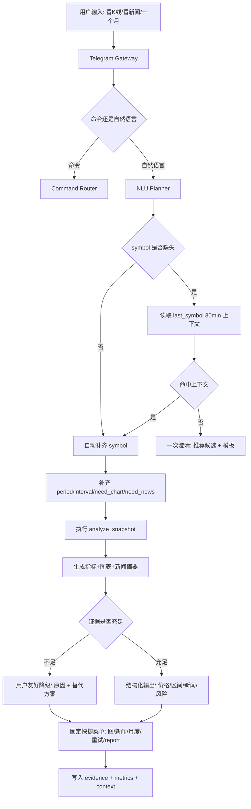

1) 主流产品的“股民友好 Telegram 投研代理”流程共性（结合当前项目，归纳截至 2026-02-27）

把“能聊、能看、能追踪”的投研助手拆开看，主流产品在 Telegram/Chat 场景通常坚持以下六条：

- 上下文连续：同一会话自动沿用最近标的（symbol carry-over），避免反复追问。
- 意图优先：用户说“看K线/看新闻/一个月”，系统先识别意图与时间槽位，再决定是否要补问。
- 证据先于结论：没有价格/区间证据时，不给“偏弱/中性”这类技术结论。
- 失败可解释：图表或指标失败时给“发生了什么 + 可选下一步”，不暴露内部报错词。
- 快捷交互：每次回复都给固定操作菜单（重试图、新闻摘要、区间分析、报告详情）。
- 治理可追溯：clarify、上下文命中、降级原因、证据映射全部可统计、可回放。

结论：
- 升级5核心不是“增加更多命令”，而是把现有升级4能力改造成“股民可读、可连续使用、可信”的产品体验。

2) Alpha-Insight 对应的业务流程图（升级5：上下文默认 + 证据优先 + 用户友好降级）

3) Alpha-Insight 升级5计划书（股民友好体验版）

0. 计划目标（2026 Q2）

把 Telegram 体验从“能跑通”升级到“股民可用”：
- 自动沿用最近标的（30分钟）减少重复追问；
- “一个月/近30天/本月”必须生效并回显分析区间；
- 指标与图失败时输出用户版解释和替代路径；
- 输出结构固定且证据化，避免“空结论”。

1. 需求合理性分析（为什么现在做）

业务合理性：
- 当前链路虽可执行，但用户反馈“像工程调试信息”，信任感不足。
- 高频场景是连续追问同一标的；每次要补 symbol 会显著降低留存。
- 结论若缺价格证据，会被视为“玄学评分”，损害产品可信度。

技术合理性（结合当前仓库）：
- 升级4已具备 clarify follow-up、降级文案、evidence 追溯与 access_mode。
- 缺口集中在边界层：slots 补全、context 记忆、模板与文案、证据展示口径。
- 可在 `telegram_gateway/actions/store` 增量实现，不触碰核心研究内核。

2. To-Be 总体架构原则（生产标准）

- 记住最近标的：同 chat 30 分钟内默认沿用最近成功 symbol。
- 记住最近周期：同上下文保存 `last_period_context`（TTL 同 30 分钟）。
- 显式换标的优先：用户句子出现新标的（名称/代码/“不是A是B”）必须覆盖上下文。
- 标的字典治理：维护“中文名/别名/代码”映射表，优先匹配标准代码。
- 时间槽位强约束：用户说“一个月/近30天”必须映射并回显日期窗口。
- 周期优先级固定：`用户明确周期 > 上下文周期 > 默认周期(近30天)`。
- 上下文作用域分层：私聊按 chat 维度；群聊按 user 维度（避免串单）。
- 数据口径一致：时间窗口口径写死并对用户可见（默认近30个自然日）。
- 证据优先输出：无价格证据不出技术结论；至少给新闻摘要或重试路径。
- 用户文案优先：不向用户暴露 `metrics unavailable/chart_missing` 内部词。
- 菜单化下一步：优先 inline keyboard 按钮，文本编号仅作为降级。
- 回包可关联：每条回复必须带 `request_id(short)`，有 run 时附 `run_id`。
- 安全不退化：仍保持“最多一问澄清”“高风险必确认”“request_id 绑定”。

2.1 强制修改清单（按优先级）

P0（必须）：
1. 上下文默认标的（symbol carry-over）
   - 新增 `last_symbol_context`（chat 级，TTL=30min）。
   - 新增 `last_period_context`（chat 级，TTL=30min）。
   - NL 缺 symbol 且未显式换标的时，自动沿用上次成功 symbol。
   - 显式换标的规则：句中出现新标的或“不是A是B”时，立即覆盖 last_symbol。
   - 显式换标的同义句覆盖：`换成B`、`看B`、`B怎么样`、`改看B`。
   - 轻量回显（不打断）：`默认沿用标的：腾讯(0700.HK)。如需切换请回复：换标的 TSLA`。
   - 提供显式清空上下文：`/reset` 或按钮“清空标的”。
   - `/reset` 清空范围写死：`last_symbol_context`、`last_period_context`、`pending_candidate_selection`、`pending_confirm`。
   - 指标：`symbol_carry_over_hit_rate`。
2. 标的映射字典与未知标的处理
   - 新增 `symbol_alias_map`（代码、中文名、英文名、常见别名），示例：
     - 腾讯：`0700.HK`、`TCEHY`
     - 阿里：`9988.HK`、`BABA`
   - 匹配多个候选时，必须先点选，不直接默认拍板。
   - 候选点选必须 request_id 绑定：callback payload 带 `request_id + chosen_symbol`，仅作用于该请求。
   - 已超时/已完成 request 的点选一律拒绝并提示重发。
   - 点选超时策略（5分钟）二选一并写死：
     - 策略A：超时自动取消并返回可复制命令模板。
     - 策略B（推荐）：超时默认主市场代码并回显“已默认选中，可切换”。
   - 字典治理字段：`alias_map_version`、`updated_at`，并写入 evidence。
   - 字典无命中时：
     - 明确提示“未识别该标的”，
     - 给候选示例 + 输入格式（如 `600519.SH`、`0700.HK`、`TSLA`），
     - 不执行分析，避免误标的。
3. 时间槽位补全必须生效
   - 识别：`一个月/近30天/本月/上月/近3个月/一年`。
   - 默认周期：近30天（1mo）。
   - 优先级：`用户明确周期 > 本次输入可推断周期 > 上下文周期 > 默认周期`。
   - 统一口径（写死）：`近30天=近30个自然日`（后续可切换到22交易日版本，但必须全局一致）。
   - 执行层真实传递 period；回复固定回显窗口：`YYYY-MM-DD ~ YYYY-MM-DD`。
4. 指标/图缺失用户化表达
   - 内部 reason 保留审计；用户文案统一为：
     “这次没能生成价格指标/图表，我可以重试图表或只做新闻解读。”
   - 必须用用户语言说明缺失证据项：
     - “缺价格数据”/“缺区间数据”/“未生成图表”。
   - 固定替代菜单（按钮优先）：`📈K线 📰新闻 🗓️1个月 🔁重试 📄报告`。
   - 新闻场景最小回显：`news_count + 时间窗 + 来源`。
   - 新闻为空时明确说明“近7天未抓到新闻/来源不可用”，并给按钮：`扩到30天`、`重试`。
   - 新闻降级层级写死：
     1) 有新闻：标题3条+一句总结；
     2) 无新闻但有行情：只做技术/区间，不做新闻结论；
     3) 新闻与行情都缺：信息不足 + 重试/扩窗/换源菜单。
5. 证据不足判定（deterministic）
   - 技术结论至少需要：`latest_close + data_window + (rsi/ma 任一)`。
   - 区间结论至少需要：`window_high/window_low` 或 `return_30d`。
   - 新闻结论至少需要：`news_count>=1`（推荐 `headlines>=3`）。
   - 不满足则只能走降级文案 + 替代菜单，不输出“趋势/情绪评分”。
6. 图表缺失自动重试一次
   - 用户触发 `need_chart=true` 时，图表链路先自动重试 1 次。
   - 回显重试原因/方式（如“首次未取到图表产物，已重试渲染一次”）。
   - 重试仍失败再降级，并回显可选下一步（按钮+命令模板）。
   - 记录指标：`chart_retry_attempted`、`chart_retry_success`。
   - 失败分类策略：
     - `artifact_missing`：允许重试提取/渲染；
     - `data_empty`：不做无效重试，直接给扩窗/换源/仅新闻菜单。
7. 最小可用快照兜底
   - 有价格数据则给：当前价、近月涨跌、区间高低（至少一条）。
   - 固定回显：`数据时间` + `数据来源`。
   - 连价格都缺失则只给新闻摘要与风险提示，不给技术结论评分。
8. 证据可见强约束（输出级）
   - 每条回复至少包含 1 条可见证据，允许字段白名单：
     - 当前价/最新收盘价
     - 近30天涨跌幅
     - 区间高/区间低
     - 数据时间
     - 数据来源
     - news_count
     - 图表状态（已生成/生成中/失败-用户版）
9. 群聊/私聊差异规则
   - 私聊：按 chat carry-over。
   - 群聊：默认按 user 维度 carry-over（禁 chat 维度共享）。
10. 权限兜底（监控创建）
   - 私聊：允许创建。
   - 群聊：仅管理员或白名单用户可创建监控。
11. 发送与长度治理
   - 图+文+菜单合并为最少消息（1~2条）；
   - 失败时退化为 1 条短文本 + 按钮；
   - 新闻标题截断策略：单条最长 N 字，总长度超阈值仅发 Top3。

P1（强烈建议）：
1. “看K线图”显式意图直达 `need_chart=true`，减少二次表述。
2. symbol 多候选点选
   - 示例：腾讯 -> `0700.HK / TCEHY`，阿里 -> `9988.HK / BABA`。
   - 当命中多个候选时不自动拍板，先按钮点选一次。
3. 新闻窗口默认与切换
   - 默认最近7天新闻摘要（3条标题+一句结论）。
   - 提供按钮切换：`7天/30天`。
4. 30 秒内同请求去重后回显状态（生成中/已生成 run_id）。
   - 菜单状态化：
     - 图生成中：`📈K线(生成中…)`
     - 图已生成：`📈K线(已生成)` + `📄报告`
   - chart 状态落库：
     - `chart_state=none|rendering|ready|failed`
     - `chart_updated_at`
5. 输出最低配关键位
   - 至少回显：近30天区间 `Low/High` + “当前价接近上沿/下沿”。
6. `/report full` 证据块补充：
   - `metric_source_keys`
   - `data_window`
   - `fallback_reason(optional)`。
7. 情绪分/趋势判定改为可选层
   - 默认简版不展示裸分数；
   - `/report full` 才展示评分与模型细节。

P2（可选加分）：
1. 用户文案禁词门禁测试
   - 对用户可见消息禁止出现：`metrics unavailable`、`chart_missing`、`traceback`、内部字段名。
2. 结构化输出固定顺序：
   - 标的+区间 -> 价格摘要 -> 技术一句话(有证据才给) -> 新闻一句话 -> 风险 -> 菜单。
3. 体验运营指标补齐：
   - `clarify_avoid_rate`（carry-over 避免澄清比例）
   - `chart_success_rate_after_retry`
   - `evidence_visible_rate`（回复含至少一条用户可见证据比例）
4. follow-up 一键继续问：
   - `近3个月`、`只看新闻`、`设置监控`。
5. 解释型快捷按钮：
   - `为什么不给K线`、`为什么不给RSI`。
6. 证据可见强约束（输出级）：
   - 每条回复至少含 1 条用户可见证据：
     `价格/区间/新闻条数/数据时间/数据来源/图表生成状态` 之一。

3. 路线图（生产版：单阶段 T）

阶段 T（P0/P1 一体交付）：股民友好体验收敛

- T1. 上下文与槽位
  文件：`services/telegram_store.py`、`services/telegram_gateway.py`、`agents/telegram_nlu_planner.py`
  完成定义：
  1. `last_symbol_context` 读写与 TTL 清理。
  2. 显式换标的覆盖规则 + 轻量回显 + `/reset` 清空。
  3. `symbol_alias_map` 匹配、候选点选（request_id绑定）与超时策略。
  4. period 语义映射、优先级、context记忆与窗口固定回显（统一口径）。
  5. `/reset` 清空范围落地。
  6. carry-over 与 clarify 协同（仍最多一问）。

- T2. 用户友好降级
  文件：`services/telegram_actions.py`、`services/telegram_chart_service.py`
  完成定义：
  1. 指标键兼容映射（`data_close/technical_rsi_14` 与 `latest_close/rsi14`）。
  2. 图表自动重试一次后再降级（区分 artifact_missing/data_empty）。
  3. 用户版降级文案（缺什么说什么）+ 按钮化替代菜单 + 状态化按钮。
  4. 无证据不输出技术结论（deterministic 规则）。
  5. 新闻回复固定回显 `news_count/时间窗/来源`。
  6. 发送与长度治理（消息合并、标题截断、超长降级）。

- T3. 证据与指标
  文件：`services/telegram_store.py`、`services/telegram_actions.py`
  完成定义：
  1. `/report full` 增强证据块。
  2. 新增指标：
     - `symbol_carry_over_hit_rate`
     - `period_slot_apply_rate`
     - `fallback_with_next_step_rate`
     - `evidence_backed_conclusion_rate`
     - `clarify_avoid_rate`
     - `chart_success_rate_after_retry`
     - `evidence_visible_rate`
     - `chart_retry_attempted`
     - `chart_retry_success`
     - `alias_map_version`
     - `chart_state_distribution`

阶段 T 验收：
1. “看看K线图”后补“腾讯的”可连续执行；
2. “不是腾讯，是阿里”可立即切换 symbol，不再追问；
3. 紧接着“看看新闻怎么说”默认沿用当前 symbol，不再追问；
4. “一个月腾讯分析”必须回显时间窗口并执行对应 period；
5. 图表缺失会自动重试 1 次，仍失败才降级；
6. 多候选标的点选在 5 分钟内可选，超时按预设策略处理；
7. 指标/图缺失时给用户友好解释+按钮化替代菜单（含状态）；
8. `/reset` 可清空上下文标的；
9. 群聊不会发生跨用户串标的；
10. 回复均带 request_id(short)（有 run 则附 run_id）；
11. `/analyze /monitor /list /stop /report /digest` 命令行为不回归。

4. 改动规模评估（针对当前仓库）

预计新增/改动：
- 改动：
  - `agents/telegram_nlu_planner.py`
  - `services/telegram_gateway.py`
  - `services/telegram_actions.py`
  - `services/telegram_chart_service.py`
  - `services/telegram_store.py`
  - `tests/test_telegram_phase_d.py`（或新增 `tests/test_telegram_phase_t.py`）

工作量（单阶段）：
- 代码：约 300-600 行增量
- 测试：约 8-14 个新增/调整用例
- 工期：1-2 天

5. 持续质量门禁（生产版）

- 单测必须覆盖：
  1. symbol carry-over 命中/超时/显式换标的
  2. period 语义映射与窗口回显
  3. 证据不足 deterministic 判定与“无证据不下技术结论”
  4. 图缺失自动重试一次 + 用户化降级 + 按钮菜单
  5. 多候选点选超时策略 + `/reset` 清空上下文
  6. 文案禁词测试（禁止内部错误词暴露）
  7. 输出级 evidence 可见强约束
  8. 群聊用户维度上下文隔离
  9. 消息长度与发送合并策略
  10. 命令链路回归（至少一条）

- 验收证据：
  1. `docs/evidence/telegram_upgrade5_symbol_carry_over.json`
 2. `docs/evidence/telegram_upgrade5_period_slot_apply.json`
 3. `docs/evidence/telegram_upgrade5_friendly_fallback.json`
 4. `docs/evidence/telegram_upgrade5_report_evidence_block.json`
  5. `docs/evidence/telegram_upgrade5_chart_retry_once.json`
  6. `docs/evidence/telegram_upgrade5_message_safety_lint.json`
  7. `docs/evidence/telegram_upgrade5_symbol_alias_resolution.json`
  8. `docs/evidence/telegram_upgrade5_context_reset_and_timeout.json`
  9. `docs/evidence/telegram_upgrade5_group_context_isolation.json`
  10. `docs/evidence/telegram_upgrade5_message_compaction_and_truncation.json`

- 硬门禁：
  1. `pytest -q` 全量通过
  2. 高风险确认与 request_id 绑定不退化
  3. 澄清仍“最多一问”
  4. 无证据不输出技术结论

6. 同类能力借鉴与本项目映射

- 主流共识 1：聊天连续性（上下文记忆）优先于新增命令。
- 主流共识 2：解释失败 + 给下一步，比裸错误码更重要。
- 主流共识 3：结论必须有用户可见证据，不然宁可降级成“信息不足”。

对 Alpha-Insight 的映射建议：
1. 先落地 P0（carry-over + period 生效 + 用户化降级）。
2. 同阶段补 P1 的快捷菜单与候选澄清。
3. P2 放入后续优化，不阻塞升级5上线。

7. 升级5执行约束（避免乱改）

- 仅改 Telegram 边界层与治理层，不改 workflow/scanner 核心分析业务逻辑。
- 不改 UI（Planner Console/Streamlit）。
- 命令链路 `/analyze /monitor /list /stop /report /digest` 必须兼容。
- 严格保持：最多一问澄清、高风险必确认、request_id 绑定确认。
- 用户文案禁止暴露内部字段名（如 `metrics unavailable`、`chart_missing`）。

附：升级5首批 DoD（Definition of Done）

1. 同 chat 在 30 分钟内可默认沿用最近 symbol（用户不再反复补标的）。
2. 用户显式换标的（如“不是腾讯，是阿里”）会立即覆盖上下文标的。
3. “一个月/近30天/本月/近3个月/一年”可正确映射并回显时间窗口。
4. 指标或图缺失时返回用户友好解释 + 按钮化替代选项。
5. need_chart 请求会自动重试图表一次，失败再降级。
6. 多候选标的点选具备超时策略（取消或默认选中并回显）。
7. `/reset` 可清空 symbol 上下文，防止跨话题误沿用。
8. 无价格证据时不输出技术结论评分，改为信息不足与替代分析路径。
9. 新闻回复至少回显 `news_count + 时间窗 + 来源`；新闻为空时给扩窗/重试路径。
10. `/report <run_id> full` 含证据块与 metric_source_keys。
11. 用户可见消息不含内部错误词（含测试门禁）。
12. 每条回复至少 1 条用户可见证据（输出级强约束）。
13. 群聊按用户维度上下文，不发生跨用户串标的。
14. 每条回复带 request_id(short)（有 run 则附 run_id）。
15. `pytest -q` 全量通过，且命令链路无回归。
8. 去重命中回包增强
   - 提示“已在生成/已生成 run_id=xxx”，并给按钮：`📄报告`、`🔁强制重跑`。
9. 强制重跑入口
   - `🔁强制重跑` 可绕过去重，但仍受限流和风控约束。
10. TTL 刷新策略
   - 成功请求刷新上下文 TTL；
   - `/reset` 立即清空且不受刷新影响。
7. 当前状态卡片
   - 按钮：`当前标的/当前周期/当前新闻窗`。
8. 市场切换按钮
   - 当中文名多市场候选时可切换 `HK/A/US`。
