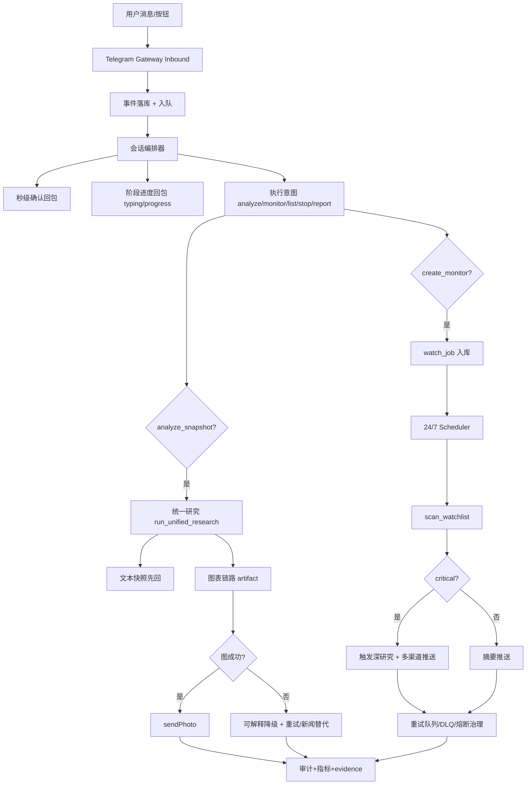

1) 主流产品的“流畅对话 + 24/7 实时分析代理”流程共性（结合当前项目，归纳截至 2026-02-27）

把“在 Telegram 里像真人助手一样连续沟通，同时 24/7 盯盘与推送”拆开看，生产系统通常采用同一套七层架构：

接入层（Inbound Channel）：
- 渠道收消息与业务执行解耦：先收消息，再异步消费。
- 消息统一事件模型（channel/chat_id/user_id/content/media/metadata）。

会话层（Session + Context）：
- 会话采用 append-only 历史，避免并发改写导致上下文错乱。
- 上下文支持短期承接（clarify/follow-up）与长期记忆（归档/摘要）分层。

编排层（Orchestrator）：
- 主循环负责任务编排，不直接绑定某个渠道 SDK。
- 每个会话支持独立任务管理（进行中、取消、超时、重试）。

响应层（Progressive Response）：
- “秒级确认 + 阶段进度 + 最终结果”三段式回包。
- typing 指示、长消息切分、图文分段发送，降低“卡住”体感。

分析层（Realtime Watch + Research）：
- 24/7 轮询与触发研究分层：扫描器负责发现信号，研究器负责深分析。
- 关键告警走高优先级路径，普通告警走摘要路径。

治理层（Reliability + Degrade）：
- 失败可恢复（重试队列/DLQ/熔断/退化开关）。
- 有损但可用：图表失败回文本、LLM 失败回命令提示、网络抖动不崩服务。

可观测层（Audit + Metrics）：
- 端到端指标：消息接收延迟、分析耗时、推送成功率、队列深度、降级命中率。
- 全链路证据可回放（request_id/run_id/schema_version/action_version）。

结论：
- 升级6重点不是“再加几个命令”，而是把 Alpha-Insight 提升为“低等待感 + 高可用 + 持续运行”的产品级代理。

2) Alpha-Insight 对应的业务流程图（升级6：流畅对话与 24/7 双主线）

3) Alpha-Insight 升级6计划书（吸收 nanobot 的可用能力）

0. 计划目标（2026 Q2）

把 Alpha-Insight 从“功能可用”升级为“体验流畅、长期稳定”的 Telegram 投研代理：
- 对话体感：消息不再“长时间无响应”；
- 会话体感：`你好/你会什么/怎么用` 这类常规对话可稳定回答，不再误判拒绝；
- 运行体感：网关不因短暂网络抖动退出；
- 分析体感：文本先回、图后补、失败可解释；
- 运营体感：24/7 监控可持续，异常可观测可恢复。

1. 需求合理性分析（为什么现在做）

业务合理性：
- 你当前用户痛点已明确：体感“偶发无反应”、新闻覆盖不足、图表偶发失败。
- 这些痛点本质上是“交互节奏与运行韧性”问题，不是单个算法问题。

技术合理性（结合当前仓库）：
- Alpha-Insight 已有核心能力：
  - `services/telegram_gateway.py`（接入与编排）
  - `services/telegram_actions.py`（回复与图文）
  - `services/watch_executor.py` + `agents/scanner_engine.py`（24/7 扫描与告警）
  - `services/reliability_governor.py`（降级治理）
- nanobot 可直接借鉴的“高价值模式”：
  - 事件总线解耦（`nanobot/bus/*`）
  - 渐进式回包（progress/tool_hint + typing）
  - 会话 append-only + 后台记忆归档
  - 渠道管理器统一路由

核心缺口：
- 还缺统一“事件队列”层，Inbound 与执行仍耦合偏高。
- 还缺“进度流式回包”机制（目前多为完成后一次性回包）。
- 缺少“通用对话兜底通道”，低风险闲聊/能力咨询容易走到拒绝模板。
- 24/7 任务链路虽完整，但缺更细颗粒的队列观测与拥塞治理指标。

2. To-Be 总体架构原则（生产标准）

- 先响应后完成：先确认请求已受理，再逐步回进度与结果。
- 输入输出解耦：消息接入、任务执行、消息发送分层并用事件衔接。
- 会话一致性优先：每会话单飞（single-flight）与取消机制并存。
- 对话优先可达：无风险普通对话默认可回答，交易/高风险动作仍走确认门禁。
- 失败可恢复：超时/网络错不导致进程退出，进入重试或降级路径。
- 24/7 优先可用：宁可摘要退化，也不让调度停摆。
- 指标驱动运营：所有降级与恢复都需有可观测依据。

2.1 强制修改清单（按优先级）

P0（必须）：
1. 渐进式对话响应（Progressive Response）
   - 收到分析类请求后 1 秒内回“已受理 + request_id(short)”。
   - 增加阶段消息：`识别标的 -> 拉取行情 -> 融合新闻 -> 图表处理`。
   - 图文拆分：先文本快照，再补图，避免图失败拖垮整体体验。
2. typing/action 心跳
   - 在长耗时执行期间周期发送 `typing` 或 `upload_photo`。
   - 超时或任务完成必须自动停止心跳，避免僵尸状态。
3. Inbound/Execution 解耦队列化
   - Gateway 收到 update 后优先落库入队，执行由 worker 拉取。
   - 增加队列深度指标：`inbound_queue_depth`、`execution_queue_lag_ms`。
4. 24/7 调度韧性增强
   - Scheduler 失败隔离：单 job 异常不影响当轮其他 job。
   - 重试与 DLQ 可视化：`retry_pending_count`、`dlq_count` 与趋势告警。
5. 新闻抓取覆盖与映射一致性
   - 多源聚合 + 去重 + 时序排序（已在当前分支方向上实施）。
   - Telegram 读取统一 `news_items`，避免“抓到但显示 0 条”。
6. 通用对话兜底（General Conversation Fallback）
   - 新增低风险对话意图白名单：`greeting/capability/help/how_to_start`。
   - 对 `你好/你会什么/怎么用` 返回固定能力卡 + 下一步按钮，不进入拒绝模板。
   - 非命令文本未命中投研意图时，优先走“对话回答”，仅高风险请求才进入确认/拒绝流程。

P1（强烈建议）：
1. 会话单飞（Per-session Single-Flight）
   - 同会话同类分析请求在短窗口内复用已有 run，避免重复重算。
2. 多级超时策略
   - NLU 超时、研究超时、发图超时分别治理，不互相污染。
3. 渠道适配层抽象
   - 把 Telegram/Webhook/未来渠道统一到 `ChannelAdapter` 接口。
4. 进度回包开关
   - 配置化：`send_progress=true/false`，生产可灰度控制噪音。

P2（可选加分）：
1. 会话历史压缩归档
   - 参考 nanobot 的 append-only + 后台 consolidate，降低上下文膨胀。
2. “停止任务”用户指令
   - 支持 Telegram `/stop` 取消当前会话执行任务。
3. 优先级车道
   - critical 信号进入 fast lane，normal/digest 进入 batch lane。

3. 路线图（生产版：A/B/C/D）

阶段 A（P0）：对话流畅底座
目标：消除“无反应感”。

- A1. 秒级确认与进度回包
  文件：`services/telegram_gateway.py`、`services/telegram_actions.py`
  完成定义：
  1. analyze 请求立即确认。
  2. 执行中分阶段回包。

- A2. typing 心跳
  文件：`tools/telegram.py`、`services/telegram_actions.py`
  完成定义：
  1. 新增 `sendChatAction` 工具函数。
  2. 生命周期绑定执行上下文。

- A3. 通用对话能力卡
  文件：`agents/telegram_nlu_planner.py`、`services/telegram_gateway.py`、`services/telegram_actions.py`
  完成定义：
  1. 增加 `greeting/capability/help` 轻量意图识别。
  2. 返回固定能力说明（可做什么/怎么开始/示例提问）与快捷按钮。
  3. 低风险普通对话默认可答，高风险动作仍走原确认链路。

阶段 B（P0/P1）：24/7 实时分析韧性
目标：调度持续运行且可恢复。

- B1. 执行队列与观测
  文件：`services/telegram_gateway.py`、`services/telegram_store.py`
  完成定义：
  1. 明确入队/出队时序。
  2. 新增队列延迟与堆积指标。

- B2. 调度与告警治理增强
  文件：`services/scheduler.py`、`services/watch_executor.py`、`services/reliability_governor.py`
  完成定义：
  1. retry/DLQ 指标完善。
  2. 降级恢复阈值优化（按渠道与任务类型分开）。

阶段 C（P1）：渠道抽象与一致体验
目标：用统一结构保持 Telegram 与未来渠道一致。

- C1. ChannelAdapter 抽象
  文件：`services/notification_channels.py`、`tools/telegram.py`
  完成定义：
  1. 统一 send_text/send_photo/send_progress。
  2. 失败分类统一归档。

- C2. 长消息与格式治理
  文件：`services/telegram_actions.py`
  完成定义：
  1. 长消息切分。
  2. 统一安全文案与禁词门禁。
  3. 对话模板文案统一（欢迎语、能力卡、错误提示口径一致）。

阶段 D（P2）：会话与记忆增强
目标：连续对话更自然、成本更可控。

- D1. 会话历史压缩归档
  文件：`services/telegram_store.py`、`services/telegram_gateway.py`
  完成定义：
  1. 历史窗口压缩。
  2. 保留可回放证据字段不丢失。

- D2. 任务取消与抢占
  文件：`services/telegram_gateway.py`
  完成定义：
  1. `/stop` 取消当前执行。
  2. 返回取消结果并审计。

4. 改动规模评估（针对当前仓库）

预计新增/改动：
- 改动：
  - `agents/telegram_nlu_planner.py`
  - `services/telegram_gateway.py`
  - `services/telegram_actions.py`
  - `tools/telegram.py`
  - `services/telegram_store.py`
  - `services/scheduler.py`
  - `services/watch_executor.py`
  - `services/reliability_governor.py`
  - `tests/test_telegram_phase_d.py`
  - `tests/test_telegram_phase_c.py`
  - `tests/test_week4_system.py`

工作量（分阶段）：
- 代码：约 600-1200 行增量
- 测试：约 15-25 个新增/调整用例
- 工期：3-6 天

5. 持续质量门禁（生产版）

- 单测必须覆盖：
  1. 秒级确认 + 进度回包顺序
  2. typing 心跳启动/停止
 3. `你好/你会什么/怎么用` 对话兜底与能力卡输出
 4. 图文拆分与图失败降级
 5. 队列堆积与并发下的会话单飞
 6. 调度重试与 DLQ 路径
 7. 新闻多源聚合去重与 Telegram 显示一致

- 验收证据：
  1. `docs/evidence/telegram_upgrade6_progressive_response.json`
  2. `docs/evidence/telegram_upgrade6_typing_heartbeat.json`
 3. `docs/evidence/telegram_upgrade6_general_conversation_fallback.json`
 4. `docs/evidence/telegram_upgrade6_scheduler_resilience.json`
 5. `docs/evidence/telegram_upgrade6_news_recall_mapping.json`
 6. `docs/evidence/telegram_upgrade6_queue_observability.json`

- 硬门禁：
  1. `pytest -q` 全量通过
  2. 监控链路 24h 不中断（无人工重启）
  3. 命令链路不回归
  4. 高风险确认与 request_id 绑定不退化

6. 吸收 nanobot 的映射清单（仅保留对本项目有用的）

1. `MessageBus` 思路 -> Alpha 的 update 入队执行解耦
   - 价值：降低网关阻塞与无响应体感。
2. 渐进式回包（progress/tool hint）-> Alpha 的阶段性状态回包
   - 价值：提升“正在处理”的可感知性。
3. Telegram typing loop -> Alpha 的长任务心跳
   - 价值：显著降低“像卡住”的感受。
4. Session append-only + 后台 consolidate -> Alpha 的上下文治理
   - 价值：避免上下文膨胀与历史污染。
5. ChannelManager 抽象 -> Alpha 的多渠道一致接口
   - 价值：后续接企业微信/邮件成本更低。
6. Cron/heartbeat 分层调度 -> Alpha 的 24/7 调度稳定性增强
   - 价值：扫描、研究、推送分层治理更清晰。
7. `/start`+`/help` 固定话术 + 非命令消息 LLM 兜底 -> Alpha 的常规对话能力
   - 价值：提升“像助手而不是命令行”的第一印象与可用性。

7. 升级6执行约束（避免乱改）

- 不重写核心研究引擎（`run_unified_research` 主链路保持）。
- 不破坏升级5已上线行为（symbol carry-over、按钮动作、解释文案）。
- 不牺牲审计与安全边界换“表面流畅”。
- 所有新增流畅机制必须可配置开关、可灰度回滚。

8. 进一步优化建议（建议纳入升级6）

1. E2E 金丝雀会话（Canary Session）
   - 每 5~10 分钟自动发一条标准分析请求到测试 chat，验证“接收->执行->回包”全链路。
   - 新增指标：`canary_success_rate`、`canary_latency_p95_ms`。
   - 价值：比单点健康检查更早发现“看起来在线但实际上不回包”的故障。

2. 对话流控与节流（Anti-Flood）
   - typing/progress 回包增加最小间隔与抖动（jitter），避免高并发下 API 被限流。
   - 新增配置：`progress_min_interval_ms`、`typing_heartbeat_seconds`。
   - 价值：提升高峰期稳定性，避免“越提示越卡”。

3. 分析结果短窗缓存（Session Result Cache）
   - 同会话同 symbol/period/interval 在 60~120 秒内复用最近结果（文本/图表路径）。
   - 新增指标：`analysis_cache_hit_rate`、`analysis_cache_ttl_expired`。
   - 价值：减少重复重算，显著降低等待时长与成本。

4. 回调幂等强化（Callback Idempotency）
   - 对 `act|...` 与 `pick|...` 建立 callback_id 去重表，防止客户端重复点击触发重复执行。
   - 价值：减少重复图表生成、重复推送与状态错乱。

5. 新闻源质量评分与自适应排序
   - 记录每个 source 的可用率、时效性、重复率，按评分动态调整抓取优先级。
   - 新增指标：`news_source_success_rate`、`news_source_freshness_ms`、`news_source_duplicate_rate`。
   - 价值：解决“有源但无有效新闻”的长期体验问题。

6. 成本治理（Cost Governor）
   - 按 intent 设置 token/调用预算阈值，超阈值自动降级为摘要模式或延迟执行。
   - 新增指标：`llm_cost_per_request`、`degrade_by_cost_count`。
   - 价值：避免 24/7 运行成本失控，保障可持续运营。

7. 自动化故障处置（Auto-Remediation）
   - 当网关/调度进程退出或连续超时，自动重启并写入审计事件。
   - 新增事件：`process_auto_restart`、`restart_reason`。
   - 价值：减少人工值守，提高夜间稳定性。

8. 体验一致性基线（UX Contract Tests）
   - 固定验证回包顺序：`受理 -> 进度 -> 结果/降级`，并验证禁词门禁与按钮可用性。
   - 价值：防止后续迭代把“流畅对话”回退成“工程输出”。

附：升级6 首批 DoD（Definition of Done）

1. 用户发分析请求后 1 秒内收到“已受理”消息。
2. 长任务期间每 3-5 秒有可见进度（typing 或阶段文本）。
3. `你好/你会什么/怎么用` 返回能力卡与可执行示例，不进入拒绝模板。
4. 文本结果可先于图片返回；图片失败不阻断文本。
5. Scheduler 与 gateway 在网络抖动下不中断主循环。
6. `pytest -q` 全量通过，且升级5验收行为不回退。
