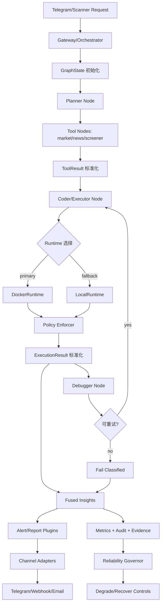

# Alpha-Insight Upgrade7：后端工程化升级（生产底座版）
**基线截至：2026-02-27**

> 目标：把 Alpha-Insight 从“功能完整”升级为“后端长期可维护、可扩展、可治理”的生产系统底座。  
> 原则：升级7重点不是新增功能点，而是统一协议、可插拔、可治理、可持续迭代。

---

## 0. 背景与定位

Alpha-Insight 已完成 Week1–Week4 的主要功能能力（沙箱执行、行情抓取、自动纠错闭环、研报输出、Telegram 推送、实时扫描、分级告警、Streamlit 双前端、安全 guardrails、观测封装）。  
下一阶段瓶颈不在“有没有功能”，而在“新增策略/渠道/数据源时是否能持续扩展、稳定演进、可回归验证”。

Upgrade7 将后端升级为“统一状态 + 统一协议 + 执行安全一致 + 插件化 + 连接器治理 + 可观测闭环”的工程化底座。

---

## 1. 计划目标（2026 Q2）

### 1.1 架构目标
- **统一状态**：GraphState 作为跨节点单一真相来源（request/run/evidence/retry/failure 合约固化）。
- **统一协议**：Node I/O Contract 固化，节点间只通过状态对象读写通信，避免隐式耦合。
- **工具结果统一**：ToolResult 全域标准化（source/ts/confidence/raw/error），减少 if-else 兼容分支。
- **用户响应契约**：Telegram 用户可见输出与内部审计证据解耦，禁止向用户暴露 schema/action_version/traceback 等内部字段。
- **执行安全一致**：Docker 与 Local fallback 同一套 Policy 强制生效，消除 fallback 安全口子。
- **可扩展**：signals/alerts/policies 插件化；配置驱动加载，支持分环境覆盖与强校验。
- **可治理**：连接器统一限流/重试/错误码/观测字段；故障聚类、阈值告警、降级开关形成闭环。
- **可回归**：节点契约测试 + evidence 脚本形成硬口径证据，支持持续复用。

### 1.2 安全目标
- Policy 与 Runtime 解耦；任何 runtime（Docker/Local）必须通过同一 Policy.enforce()。
- 审计证据不弱化：执行、工具调用、降级、重试均有可追溯字段。

### 1.3 运维目标
- 对外访问统一走 Connector/Adapter，统一超时/限流/重试/错误码，便于快速替换上游、熔断降级。

---

## 2. 非目标（避免 scope 膨胀）

- 不重写已稳定的 Telegram 交互主链路（升级5/6 的 request_id、候选点选、确认绑定、降级体验必须保持）。
- 不以“性能优化”为名弱化安全策略或审计证据。
- 不在升级7内追求“前端完全替换”，前端仅做与 API/服务分层强绑定的必要改造（详见第 16 章）。
- 不把 8502 全量页面字段原样搬进 Telegram；电报端按“高可读摘要 + 可追溯证据 + 下一步动作”输出。

---

## 3. 生产系统共性：九层后端架构（Upgrade7 To-Be）

> 生产系统通常采用同一套分层：  
> **State / Contract / Domain Schema / ToolResult / Runtime+Policy / Plugin+Config / Connector+Adapter / Store / Governance**

### 3.1 状态层（Workflow State）
- GraphState 统一承载：请求上下文、执行产物、错误与重试信息、证据与审计字段。
- 节点间只通过 GraphState 读写通信，禁止隐式全局变量耦合。

### 3.2 协议层（Node I/O Contract）
- 每个节点固定输入/输出契约（required/optional 字段、错误码约定、回退语义）。
- 节点失败分类（data/sandbox/network/logic/timeout/rate_limit）并进入标准重试策略。

### 3.3 领域模型层（Domain Model / Schema）
- 将 GraphState / ToolResult / ExecutionResult / Run / Evidence / FailureEvent 等作为“域模型”统一定义。
- 提供版本号与兼容策略（schema versioning），为 typed OpenAPI client 铺路。

### 3.4 工具层（ToolResult Standardization）
- 所有外部工具输出统一结构：`source/ts/confidence/raw/error`（可扩展 meta 字段）。
- 行情工具、新闻工具、扫描器、回退爬虫全部对齐，便于融合与追溯。

### 3.5 执行层（Runtime + Policy）
- 执行方式（DockerRuntime/LocalRuntime）与安全策略（Policy）解耦。
- 不同 runtime 必须执行同一套 Policy，避免 fallback 成为后门。
- 输出统一 ExecutionResult，Debugger 仅依赖标准结构。

### 3.6 策略层（Plugin + Config）
- 指标策略、告警策略、风控策略插件化（signals/alerts/policies）。
- 配置驱动加载，支持 base + env override + runtime flags 合并优先级与强校验。

### 3.7 连接层（Connector + Adapter）
- 数据源、新闻源、图表服务、通知渠道采用统一连接器抽象。
- 限流、重试、错误码、观测字段通过公共基类统一。

### 3.8 存储层（Run Store / Artifact Store）
- Run 元数据（run_id/request_id/状态/耗时/错误分类）与产物（stdout/stderr/traceback/charts）必须有明确存储策略。
- 支持 run 回放与审计证据的稳定读取，不依赖“散落文件”。

### 3.9 治理层（Observability + Reliability）
- 指标、审计、证据、告警规则统一聚合。
- 故障聚类、阈值告警、降级/恢复开关形成闭环治理（Reliability Governor）。

---

## 4. Alpha-Insight 升级7业务流程图（后端工程化主线）

## 5. 当前仓库基础与核心缺口（Why now）
### 5.1 当前基础（可复用资产）

agents/workflow_engine.py 已具备 GraphState 与 retry/traceback/failure_events 基础。

services/telegram_gateway.py 与 services/telegram_actions.py 已形成成熟交互编排。

core/observability.py 已有失败聚类与阈值告警雏形。

已有 evidence 脚本：scripts/hard_acceptance_evidence.py，可扩展升级7硬证据。

### 5.2 核心缺口（升级7要解决）

fallback 路径安全一致性仍可提升（Policy 与 Runtime 未完全解耦，存在“后门风险”）。

Tool 输出协议不统一，汇总层存在多套字段兼容逻辑。

策略/告警/风控仍偏内嵌业务逻辑，插件化不足，扩展成本高。

节点契约测试与集成回归分层可加强，升级迭代风险偏高。

RunStore/ArtifactStore 未固化，会限制 run 回放、审计、Web 控制台演进。

## 6. To-Be 总体架构原则（生产标准）

状态单源：GraphState 是唯一跨节点真相来源。

协议优先：Node I/O 与 ToolResult 先定义再实现。

策略一致：Security Policy 在 Docker/Local runtime 下强制一致。

插件优先：新增策略能力默认走插件，不直接写死主流程。

连接解耦：外部源访问统一走 Connector/Adapter，统一限流与重试。

可观测先行：新增链路必须自带 metrics/audit/evidence。

回归可证：每阶段都有 pytest + evidence 的硬证据可交付。

## 7. 强制修改清单（按优先级）
### P0（必须）

Sandbox Policy/Runtime 双层重构

新增 Policy（规则）与 Runtime（DockerRuntime/LocalRuntime）分层。

本地 fallback 必须执行同一 Policy，不允许绕过。

ExecutionResult 标准结构

统一：stdout/stderr/exit_code/traceback/backend/duration_ms/resource_usage(optional)。

Debugger/报告仅消费标准字段。

ToolResult 标准化

所有工具统一：source/ts/confidence/raw/error（允许 meta 扩展）。

Node I/O Contract 固化

Planner/Coder/Executor/Debugger：字段契约、错误码、重试约定固化为 schema + contract tests。

Telegram 输出治理（UserResponseContract）

用户文案层与审计证据层分离：用户消息只保留决策必要信息，内部证据写入 store/evidence，不直接透传给聊天窗口。

补齐 TelegramRenderer 规则：消息密度限制（默认主消息 1 条 + 补充 1 条）、字段白名单、长度上限、双语模板一致性。

上下文继承保护：symbol/period 自动继承需显式确认或强提示，降低“误继承到错误标的”。

分析深度基线（合理增强，不做全量搬运）：电报端复用 8502/8501 后端结果，默认至少输出“结论一句话 + 价格区间位置 + 1 条技术证据 + 新闻计数/窗口 + 风险提示 + 下一步按钮”。

监控场景分层：critical 告警附 3 行研究摘要（结论/证据/动作），high/normal 保持轻量告警格式。

### P1（强烈建议）

StrategyPlugin 层落地

signals/、alerts/、policies/ 三类插件。

插件隔离壳：超时/异常捕获/降级输出 PluginError，避免拖垮主链路。

配置分层与校验增强

base + env override + runtime flags 合并优先级可追踪。

引入结构化校验与一致性校验（启动期 fail-fast）。

Connector 抽象统一

数据源/新闻源/图表服务统一 adapter 与错误语义。

增加 Throttler（限流）与 RetryPolicy（重试）标准实现。

### P2（可选加分）

节点级基准与故障注入（latency/error budget）

扩展更多渠道（Webhook/Email/WeCom 等），复用 ChannelAdapter

策略市场化分层：research-only / alert-only / execution-ready

## 8. 路线图（A/B/C/D 分阶段交付）
### 阶段 A（P0）：执行安全与执行协议底座

目标：执行安全一致、结果结构一致。

A1. Policy/Runtime 分层

涉及：core/guardrails.py、core/sandbox_manager.py、core/sandbox.py

新增建议：core/sandbox_policy.py

DoD：

Docker/Local 都必须走 Policy.enforce()

Policy 覆盖 import/path/network/tool-permissions/timeout

A2. ExecutionResult 标准化

涉及：core/sandbox_manager.py、agents/workflow_engine.py

DoD：

执行结果字段统一

Debugger/报告链路只读 ExecutionResult（零 runtime 私有字段依赖）

### 阶段 B（P0/P1）：状态与工具协议统一

目标：降低跨节点与跨工具耦合。

B1. GraphState 统一扩展

涉及：agents/workflow_engine.py、core/models.py

DoD：

固定 request/run/evidence/retry/failure contract

节点只通过 GraphState 交换信息

B2. ToolResult 全域收敛

涉及：tools/market_data.py、agents/scanner_engine.py、新闻/爬虫相关工具模块

DoD：

行情/新闻/扫描/回退统一 ToolResult

汇总层不再做多套字段兼容 if-else

建议：提供 legacy_adapter 过渡一段时间（避免一次性改炸）

B3. Telegram UserResponseContract 落地

涉及：services/telegram_actions.py、services/telegram_gateway.py、services/notification_channels.py

DoD：

用户可见消息不包含内部字段（例如 schema_version/action_version/traceback/raw_error 内核细节）

分析结果默认输出“结论 + 关键证据 + 下一步按钮”，不输出工程调试串

symbol/period 上下文继承命中时有明确提示；出现歧义时强制候选点选

对 analyze_snapshot：默认满足“结论/价格位置/技术证据/新闻回显/风险/动作”六要素；超长内容通过按钮二段式展开

对 monitor push：critical 自动附研究摘要；high/normal 维持简洁告警，不塞入全量细节

### 阶段 C（P1）：插件化与配置治理

目标：新增策略不改主流程。

C1. StrategyPlugin 层

新增：signals/、alerts/、policies/

DoD：

插件接口稳定（输入/输出/错误约定）

插件隔离壳：异常不穿透主链路

配置可启停与参数注入

C2. Config 分层与校验

DoD：

合并优先级可追踪（输出最终配置 diff）

启动期校验失败定位明确（字段路径+建议修复）

### 阶段 D（P1/P2）：连接器与回归体系

目标：对外扩展稳定，对内回归高效。

D1. Connector + Throttler 抽象

涉及：tools/、services/ 外部访问模块

DoD：

统一限流、重试、错误码、超时策略

新接数据源只需实现 adapter 接口

D2. 节点级测试与证据增强

涉及：tests/、scripts/hard_acceptance_evidence.py

DoD：

节点契约测试独立可跑

evidence 输出升级7新增字段统计与一致性检查

## 9. 改动规模评估（针对当前仓库）
### 9.1 预计改动文件

修改：

core/guardrails.py

core/sandbox_manager.py

core/sandbox.py

agents/workflow_engine.py

core/models.py

tools/market_data.py

agents/scanner_engine.py

services/telegram_actions.py

services/telegram_gateway.py

services/notification_channels.py（适配器一致性增强）

services/reliability_governor.py（新指标接入）

scripts/hard_acceptance_evidence.py

tests/ 下 workflow/sandbox/tools/telegram 回归用例

新增（建议）：

core/sandbox_policy.py（Policy 定义与 enforce 入口）

core/tool_result.py（或并入 models）

signals/、alerts/、policies/

core/run_store.py（或 storage/ 目录下实现）

### 9.2 规模估计

代码增量：约 900–1800 行

测试增量：约 25–40 个用例

工期估计：5–10 天（按 A/B/C/D 分阶段交付）

## 10. 持续质量门禁（生产版）
### 10.1 必须覆盖的单测

Docker/Local runtime 下 Policy 一致生效

ExecutionResult 字段完整性与兼容性

ToolResult 在行情/扫描/新闻链路一致

节点契约（Planner/Coder/Executor/Debugger）

插件加载、禁用、参数覆盖与异常隔离

Connector 限流与重试行为

Telegram 输出契约测试（字段白名单、消息密度、长度上限、双语模板一致性）

Telegram 上下文继承保护测试（carry symbol/period 提示与歧义点选）

Telegram 分析深度基线测试（analyze_snapshot 六要素、critical 与 high/normal 消息分层）

### 10.2 验收证据（硬口径）

docs/evidence/upgrade7_policy_runtime_consistency.json

docs/evidence/upgrade7_execution_result_contract.json

docs/evidence/upgrade7_toolresult_unification.json

docs/evidence/upgrade7_plugin_loading_matrix.json

docs/evidence/upgrade7_connector_reliability.json

docs/evidence/upgrade7_telegram_response_contract.json

docs/evidence/upgrade7_telegram_context_guardrails.json

docs/evidence/upgrade7_telegram_analysis_depth_baseline.json

### 10.3 硬门禁

pytest -q 全量通过

升级6现有用户链路行为不回归

fallback 安全边界不弱于 Docker 路径

failure/retry/latency 关键字段保持可追溯且可回放

## 11. P0/P1/P2：DoD → 证据映射矩阵（验收用）
### P0（必须）

Policy/Runtime 分层

DoD：同一危险用例在 Docker/Local 一致拒绝；允许用例一致通过

证据：upgrade7_policy_runtime_consistency.json + 对应 pytest

ExecutionResult 标准结构

DoD：Debugger/报告仅读取 ExecutionResult；字段齐全且稳定

证据：upgrade7_execution_result_contract.json

ToolResult 标准化

DoD：行情/新闻/扫描/回退全域一致 ToolResult schema

证据：upgrade7_toolresult_unification.json

Node I/O Contract 固化

DoD：Planner/Executor/Debugger 契约测试覆盖 required/optional/错误码/重试语义

证据：contract tests（pytest）+（可选）upgrade7_node_contract_matrix.json

Telegram 输出治理（UserResponseContract）

DoD：用户可见消息不暴露内部字段；消息密度与长度受控；结果消息结构稳定（结论/证据/下一步）；分析深度达到六要素基线

证据：upgrade7_telegram_response_contract.json + upgrade7_telegram_context_guardrails.json + upgrade7_telegram_analysis_depth_baseline.json + 对应 pytest

### P1（建议）

StrategyPlugin 层

DoD：插件可启停；单插件异常不影响主链路；插件输出可审计

证据：upgrade7_plugin_loading_matrix.json

Config 分层与校验

DoD：base/env/flags 合并可追踪；校验失败定位明确

证据：pytest + evidence 中配置合并摘要

Connector 抽象统一

DoD：统一错误码与重试策略；限流生效；可替换上游源

证据：upgrade7_connector_reliability.json

### P2（加分）

故障注入/节点基准

更多渠道

策略包分层

## 12. 风险与对策（提前写，避免后期卡）

Policy 与 Tool 权限控制分裂

对策：Policy 覆盖工具调用权限（域名白名单/禁网策略/超时/并发限制）

ToolResult 标准化引发历史字段兼容痛

对策：提供 legacy_adapter 过渡期；逐步移除旧字段

插件异常拖垮主链路

对策：插件隔离壳（timeout + exception capture + degrade），输出 PluginError 而非抛出

Connector 无统一错误码导致重试混乱

对策：定义 ErrorCode 枚举（TIMEOUT/RATE_LIMIT/AUTH/DATA_INVALID/UPSTREAM_5XX/PARSE）与默认策略

RunStore 不补齐导致 evidence 与回放不可持续

对策：最小 RunStore（sqlite 存元数据 + artifacts 目录存大对象），定义 retention 策略

typed OpenAPI client 上得过早拖慢 P0

对策：P0 先固化域模型 schema；P1 再上 typed client

上下文自动继承命中错误标的，导致用户感知“不合理回复”

对策：carry 逻辑增加显式提示与二次确认门；歧义统一走候选点选，不做隐式高置信覆盖

把 8502 全量明细直接塞进 Telegram，导致阅读负担与操作噪音

对策：执行“分析深度基线 + 按钮二段式展开”，默认摘要，按需查看更多

## 13. 吸收外部项目的映射清单（仅保留有用能力）

llm-sandbox：Policy + Runtime 分层 → sandbox 双路径一致安全

地址：https://github.com/vndee/llm-sandbox

freqtrade：策略接口 + 配置分层 + 风控插件加载 → StrategyPlugin 抽象与配置治理

地址：https://github.com/freqtrade/freqtrade

hummingbot：connector + throttler → 连接器与限流重试标准化

地址：https://github.com/hummingbot/hummingbot

Multi-agent-finance-analysis-by-langgraph：节点边界清晰 + 节点级测试组织 → 节点契约回归

地址：https://github.com/AI-lab-sh/Multi-agent-finance-analysis-by-langgraph

## 14. 升级7执行约束（避免乱改）

不重写已稳定 Telegram 交互主链路（升级5/6体验必须保持）。

不破坏 request_id、候选点选、确认绑定、降级体验。

不以性能优化为名弱化安全策略或审计证据。

新增抽象必须可灰度、可回滚、可观测。

不向 Telegram 用户透出内部调试字段；审计证据仅写入 evidence/store 与运维面板。

Telegram 只做“合理增强”不做“全量搬运”：默认摘要满足决策信息，扩展内容通过交互动作按需获取。

## 15. 附：升级7 首批 DoD（Definition of Done）

Docker 与 Local fallback 路径在同一 Policy 下执行，并有测试证据。

Executor 输出统一 ExecutionResult，下游消费零分支兼容。

行情/新闻/扫描统一为 ToolResult 协议。

StrategyPlugin 可通过配置启停并通过基础回归测试。

新增 connector 接口可在不改主流程前提下接入一个新数据源示例。

pytest -q 全量通过，升级6关键体验不回退。

Telegram 输出满足 UserResponseContract：用户读得懂、字段不泄漏、上下文继承可解释且可纠正。

Telegram 分析深度达到基线：比当前显著更充足，但仍保持可读性与低噪音。

## 16. 附：控制台前端与全栈模板吸收（Upgrade7 相关但不喧宾夺主）

原则：本期 P0 仅做“API/服务分层与资源模型”；P1 再做 typed OpenAPI client 与 Next.js 控制台壳层。

### 16.1 Next.js + shadcn 控制台骨架

next-shadcn-dashboard-starter

地址：https://github.com/Kiranism/next-shadcn-dashboard-starter

可吸收：Sidebar/Header/Layout、导航配置中心化、DataTable 基座、概览页槽位布局

### 16.2 Next.js + FastAPI 全栈模板

nextjs-fastapi-template

地址：https://github.com/vintasoftware/nextjs-fastapi-template

可吸收：后端路由/鉴权/分页范式、OpenAPI 客户端生成链路、Server Action 模式

### 16.3 Admin 框架（快速资源后台）

react-admin：https://github.com/marmelab/react-admin

refine：https://github.com/refinedev/refine

可吸收：Resource-first、dataProvider 抽象、路由治理、未保存变更提醒等

### 16.4 交易控制台信息架构参考（FreqUI）

frequi：https://github.com/freqtrade/frequi

可吸收：多视图路由职责分离、集中状态 store、日志查看器组件化、驾驶舱布局（P2 可考虑拖拽栅格）

### 16.5 本地参考路径（便于快速查阅）

> 为减少外网依赖，优先参考本机已存在代码目录（按需只读比对，不直接整包拷贝进主仓库）。

前端重点参考（P1/P2 可高比例借鉴信息架构与组件分层）：

- `/home/kkk/Project/next-shadcn-dashboard-starter`
- `/home/kkk/Project/nextjs-fastapi-template/nextjs-frontend`
- `/home/kkk/Project/react-admin`
- `/home/kkk/Project/refine`
- `/home/kkk/Project/frequi`
- `/home/kkk/Project/stock-market-dashboard/frontend`

后端少量参考（仅借鉴分层与接口治理范式，不做大规模代码迁移）：

- `/home/kkk/Project/nextjs-fastapi-template/fastapi_backend`
- `/home/kkk/Project/stock-market-dashboard/backend`
- `/home/kkk/Project/unified-trading-bot`
- `/home/kkk/Project/freqtrade`

执行约束（Upgrade7）：

- 前端：可重点参考页面信息架构、路由布局、数据表格与状态管理模式。
- 后端：仅参考契约设计、目录分层、治理模式；核心实现仍以 Alpha-Insight 现有链路为准。
- 所有参考必须保留 Alpha-Insight 的 request_id、审计证据、降级控制与安全策略语义一致性。

## 17. 附：建议的最小 API 资源模型（为 Web 控制台铺路）

只作为建议，不强制在 P0 全部实现。P0 先固化 domain schema 与 RunStore。

runs：run 列表、run 详情（含 artifacts 引用）

alerts：告警列表、告警详情（证据与发送结果）

monitors：监控池/订阅配置（Top100 + 用户自定义）

reports：研报产物列表与下载

audits：审计事件（policy deny、tool error、degrade/recover）
