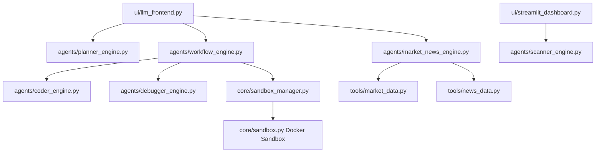

# Alpha-Insight 计划书（现状重构版，2026 Q1）

更新日期：2026-02-26  
说明：本文件是基于当前仓库真实代码状态的新版计划书；旧版 `计划书.md` 保留不变。

---

## 1. 项目定位（当前版本）

Alpha-Insight 是一个面向 A/HK/US 三市场的多 Agent 量化投研系统。  
当前核心价值不是“全自动交易”，而是：

1. 把研究流程拆成可追踪的步骤（规划 -> 代码 -> 执行 -> 调试）。
2. 把关键数值计算放入隔离执行环境（Docker sandbox）。
3. 在 UI 中提供可解释的结果分层展示（规划 / 完整分析 / 融合分析）。

---

## 2. 当前真实能力快照（As-Is）

### 2.1 两个前端入口

1. `8501` 实时驾驶舱：异动扫描、信号面板、告警相关能力。  
2. `8502` LLM 控制台：规划、完整分析、行情+新闻融合分析。

### 2.2 `8502` 当前三模式

1. `Run Planner`：只做任务拆解与理由，不执行代码。  
2. `Run Full Analysis`：走 Week2 自修复流程，执行沙箱代码并返回产物。  
3. `Run Market+News Analysis`：行情+新闻融合分析与图表展示（不走沙箱）。

### 2.3 Full Analysis 的当前执行链

`Planner -> Coder -> Executor -> Debugger(loop)`，具备：

1. `traceback` 结构化解析。
2. 失败后自动修复并重试（上限可控）。
3. UI 显示 `sandbox_code/stdout/stderr/retry_count/success`。
4. UI 显示执行后端 `sandbox_backend`（例如 `docker:quant-sandbox:latest`）。

### 2.4 沙箱现状

1. 本地 Docker 沙箱镜像：`quant-sandbox:latest`。  
2. 默认优先容器执行；不可用时会有本地进程 fallback（并在 stderr 可见）。  
3. Full Analysis 页面已可提示“真实 Docker 沙箱”或“fallback 降级”。

---

## 3. 当前架构（代码对应）

---

## 4. 差距与技术债（Gap）

### P0（必须优先）

1. Full Analysis 的沙箱脚本仍在容器内直接拉 `yfinance`。  
   但容器使用 `--network none`，会导致“容器是真沙箱但数据拉取失败”的体验断裂。  
   跟踪任务：`Alpha-Insight-78`。

### P1（产品一致性）

1. 融合分析（行情+新闻）目前不在沙箱执行。  
   结论可解释性强，但与 Full Analysis 的“隔离执行”口径不一致。  
2. 两条分析链（Full 与 Fused）尚未统一成一个“单请求、单报告”的输出协议。

### P2（工程化）

1. 计划书/README 与代码进展存在轻微错位，需要持续对齐。  
2. 运行态指标（成功率、fallback 比例、执行时延）还没有统一统计看板。

---

## 5. 2026 Q1 分阶段路线图（To-Be）

## 阶段 A（1-2 周）：修复 Full Analysis 的“真沙箱可用性”

目标：Full Analysis 在容器隔离前提下稳定产出，不依赖容器网络。

工作项：

1. 将行情抓取移到沙箱外（工具层），把标准化 records 注入沙箱脚本。  
2. Coder 仅负责“计算与绘图”，不再发起外网数据请求。  
3. 新增回归用例：断网容器下 Full Analysis 仍成功执行。  
4. UI 增加执行链路摘要：`data_source + sandbox_backend + retry_count`。

阶段验收：

1. Full Analysis 连续 20 次运行不出现 `Docker sandbox unavailable`。  
2. `sandbox_backend` 为 `docker:quant-sandbox:latest` 的比例 >= 95%。  
3. `pytest -q` 全绿。

## 阶段 B（2-4 周）：统一 Full + Fused 研究链

目标：形成单一“研究结果对象”，避免两条链路割裂。

工作项：

1. 定义统一结果 schema（规划、沙箱产物、行情新闻结论、图表索引）。  
2. 融合分析中的核心计算迁入沙箱（可分批：先技术指标，再情绪评分）。  
3. 前端保留三 Tab 视图，但底层输出协议统一。  
4. 增加“请求-标的一致性”强校验（非仅 warning）。

阶段验收：

1. 单次请求可同时生成：规划 + 沙箱计算 + 融合结论。  
2. 三 Tab 均来自同一 run_id，不再跨运行拼接。  
3. 关键数值可追溯到沙箱 stdout 或结构化 metrics。

## 阶段 C（4-6 周）：可观测与稳定性运营

目标：把“能跑”升级为“可持续运营”。

工作项：

1. 增加执行指标埋点：成功率、fallback率、平均时延、重试率。  
2. 按市场/标的维度做失败聚类（数据源失败、沙箱失败、解析失败）。  
3. 建立告警阈值（例如 fallback 连续触发）。  
4. 补齐运维 Runbook（镜像重建、端口冲突、依赖异常、权限问题）。

阶段验收：

1. 关键指标可按日查看趋势。  
2. 失败类型可自动归类并附带排障建议。  
3. 新环境可在 30 分钟内完成冷启动并跑通最小闭环。

---

## 6. 质量门禁（持续执行）

代码变更默认门禁：

1. `python -m py_compile` 覆盖新增/修改文件。  
2. `pytest -q` 全量通过。  
3. Full Analysis 至少 1 次真实运行验证（记录 backend 证据）。  
4. UI 8502 可访问且无 `StreamlitAPIException`。

---

## 7. 交付物清单（本计划对应）

每个阶段至少沉淀以下交付：

1. 代码变更 + 测试。  
2. beads 任务更新（创建、认领、关闭）。  
3. 变更说明文档（影响面、回滚点、已知风险）。  
4. 可复现实验命令（本地/容器）。

---

## 8. 当前建议优先级（立刻执行）

1. 先完成 `Alpha-Insight-78`（容器外取数、容器内计算）。  
2. 再推进融合分析关键计算入沙箱。  
3. 最后做统一结果协议和可观测指标收敛。

这条路径能最快把“看起来可用”升级成“稳定可用、可解释、可运维”。
