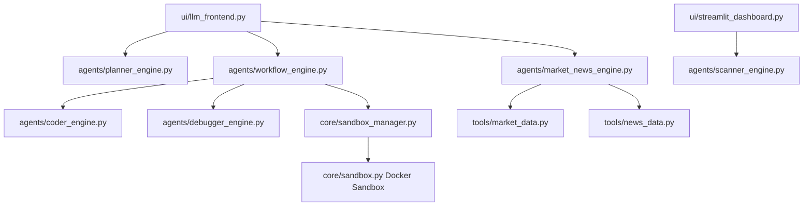
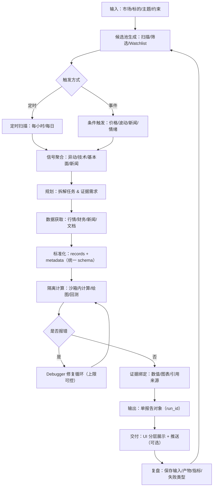

# Alpha-Insight 计划书（现状重构版，2026 Q1）

更新日期：2026-02-26  
说明：本文件基于当前仓库真实代码状态，并对齐 `升级.md` 的 A’/B’/C’/D’ 路线；旧版 `计划书.md` 保留不变。

---

## 1. 项目定位（当前版本）

Alpha-Insight 是一个面向 A/HK/US 三市场的多 Agent 量化投研系统。  
当前核心价值不是“全自动交易”，而是：

1. 把研究流程拆成可追踪的步骤（规划 -> 代码 -> 执行 -> 调试）。
2. 把关键数值计算放入隔离执行环境（Docker sandbox）。
3. 在 UI 中提供可解释的结果分层展示（规划 / 完整分析 / 融合分析）。

---

## 2. 当前真实能力快照（As-Is）

### 2.1 两个前端入口

1. `8501` 实时驾驶舱：异动扫描、信号面板、告警相关能力。  
2. `8502` LLM 控制台：规划、完整分析、行情+新闻融合分析。

### 2.2 `8502` 当前三模式

1. `Run Planner`：只做任务拆解与理由，不执行代码。  
2. `Run Full Analysis`：走 Week2 自修复流程，执行沙箱代码并返回产物。  
3. `Run Market+News Analysis`：行情+新闻融合分析与图表展示（不走沙箱）。

### 2.3 Full Analysis 的当前执行链

`Planner -> Coder -> Executor -> Debugger(loop)`，具备：

1. `traceback` 结构化解析。
2. 失败后自动修复并重试（上限可控）。
3. UI 显示 `sandbox_code/stdout/stderr/retry_count/success`。
4. UI 显示执行后端 `sandbox_backend`（例如 `docker:quant-sandbox:latest`）。

### 2.4 沙箱现状

1. 本地 Docker 沙箱镜像：`quant-sandbox:latest`。  
2. 默认优先容器执行；不可用时会有本地进程 fallback（并在 stderr 可见）。  
3. Full Analysis 页面已可提示“真实 Docker 沙箱”或“fallback 降级”。

---

## 3. 当前架构（代码对应）

---

## 4. 差距与技术债（Gap）

### P0（功能阻塞）

1. 代码层 P0 已清零：`升级.md` 对应 A’ 问题（断网沙箱内拉行情）已完成修复并关闭 `Alpha-Insight-81~84`。  
2. 当前无“阻塞主流程”的已知缺陷；主要进入运营稳定性与证据化阶段。

### P1（运营稳定性）

1. 需要持续统计真实运行中的 `docker backend 比例`、`fallback 频率`、`失败聚类`，避免只停留在单次测试通过。  
2. 需要把阶段验收结果沉淀为日常 `run_report` 产物（便于复盘和回归对比）。

### P2（交付与展示）

1. 待完成 `Alpha-Insight-bpp`（自修复 Demo 视频录制，最终 landing 素材）。  
2. 持续保持文档（README/Runbook/计划书）与实现同步。

---

## 5. 2026 Q1 分阶段路线图（升级版 A’/B’/C’/D’ 对齐）

### 5.1 阶段 A’（真沙箱可用性修复，P0）

状态：已完成（`Alpha-Insight-81~84` 均已关闭，关闭时间为 2026-02-27 +08:00）。  

已落地能力：

1. DataBundle schema 与适配器已落地（`core/models.py`, `tools/market_data.py`）。  
2. Week2 执行改为“容器外取数、容器内计算”（`agents/workflow_engine.py`, `agents/coder_engine.py`）。  
3. Guardrails 强化，阻断网络调用与动态安装（`core/guardrails.py`, `tests/test_week4_system.py`）。  
4. 断网回归与 backend 证据链已接入（`scripts/test_full_loop.py`, `tests/test_week2_workflow.py`, `ui/llm_frontend.py`）。

### 5.2 阶段 B’（统一 Full + Fused 为单报告对象，P1）

状态：已完成（`Alpha-Insight-85~88` 均已关闭，关闭时间为 2026-02-27 +08:00）。  

已落地能力：

1. 统一 `ResearchResult` / `DataBundleRef` / `Provenance` schema（`core/models.py`）。  
2. `run_unified_research` 统一编排 Full + Fused（`agents/workflow_engine.py`）。  
3. 8502 三视图绑定同一运行对象（`ui/llm_frontend.py`）。  
4. 请求-标的强校验已 fail-fast（`_validate_request_symbol_consistency` + 测试）。

### 5.3 阶段 C’（监控/告警产品化）

状态：已完成（`Alpha-Insight-89~92` 均已关闭，关闭时间为 2026-02-27 +08:00）。  

已落地能力：

1. 定时/事件触发统一调度（`agents/scanner_engine.py`, `scripts/hourly_watchlist_scan.py`）。  
2. 告警快照持久化（`AlertSnapshot` model + store）。  
3. critical 告警触发自动研究并产出 `run_id`。  
4. 通知通道抽象已引入，Telegram 为首通道。

### 5.4 阶段 D’（可观测与运营）

状态：已完成（`Alpha-Insight-93~96` 均已关闭，关闭时间为 2026-02-27 +08:00）。  

已落地能力：

1. 运行指标埋点：success/fallback/retry/latency。  
2. 失败聚类：`data/network/sandbox/fallback/...`。  
3. 阈值告警：`fallback_spike/failure_spike/latency_anomaly`。  
4. 运维文档：`README.md` + `docs/runbook.md`。

### 5.5 Q1 收尾与 Q2 入口

1. 阶段 A’~D’ 已实现并完成任务关闭，当前重点从“功能建设”转为“持续验证与运营证据沉淀”。  
2. 建议新增日级 `run_report`（成功率、fallback、告警、失败聚类）作为 Q2 常态化运营输入。  
3. 产品交付侧优先完成视频化演示任务：`Alpha-Insight-bpp`。

---

## 6. 质量门禁（持续执行）

代码变更默认门禁：

1. `python -m py_compile` 覆盖新增/修改文件。  
2. `pytest -q` 全量通过。  
3. Full Analysis 至少 1 次真实运行验证（记录 backend 证据）。  
4. UI 8502 可访问且无 `StreamlitAPIException`。

---

## 7. 交付物清单（本计划对应）

每个阶段至少沉淀以下交付：

1. 代码变更 + 测试。  
2. beads 任务更新（创建、认领、关闭）。  
3. 变更说明文档（影响面、回滚点、已知风险）。  
4. 可复现实验命令（本地/容器）。

---

## 8. 当前建议优先级（立刻执行）

1. 建立并固化日常 `run_report` 机制（按 mode/backend/market 输出成功率、fallback、失败聚类）。  
2. 持续做真实 docker 运行抽样，跟踪 `docker backend` 占比与 fallback 告警趋势。  
3. 完成 `Alpha-Insight-bpp` 演示视频，形成对外可交付 landing 材料。

这条路径能最快把“看起来可用”升级成“稳定可用、可解释、可运维”。

---

## 9. 历史能力基线（来自 `计划书.md`）

为避免上下文丢失，保留旧版计划书中的稳定事实，作为 2026 Q1 改造前的能力基线：

1. 多 Agent 基本分工已形成：
   `Planner(任务拆解) -> Coder(代码生成) -> Debugger(报错修复) -> Reviewer(结果质检)`。
2. 技术栈主干已落地：
   `LangGraph` 编排、`Docker/E2B` 沙箱、`yfinance + Crawl4AI` 数据层、`Streamlit + Telegram` 输出层。
3. Week1-Week4 已交付能力已在仓库可追溯：
   - Week1：沙箱管理、行情工具、抓取回退、Telegram 基础链路
   - Week2：自修复循环（Planner/Coder/Executor/Debugger）与 checkpoint
   - Week3：技术指标+回测、多模态产物、HITL 中断
   - Week4：扫描引擎、分级告警、可观测封装、guardrails 与驾驶舱

这部分定义的是“已具备能力”，不替代本文件第 5 节的 Q1 目标路线图。

---

## 10. 旧版 30 天路线图与 Q1 路线映射

`计划书.md` 的周节奏仍可作为执行拆分模板，映射关系如下：

1. Week1-Week2 的“基础闭环 + 自修复”，对应升级版阶段 A’（真沙箱可用性修复）。
2. Week3 的“数值门禁 + 多模态报告”，对应升级版阶段 B’（单报告对象与可追溯输出）。
3. Week4 的“扫描+告警+观测”，对应升级版阶段 C’+D’（产品化调度与运营监控）。

执行策略：沿用旧版“周粒度推进”，但验收以本版 A’/B’/C’/D’ 阶段门禁为准。

---

## 11. 升级版业务闭环（来自 `升级.md`）

---

## 12. 验收证据（硬口径补齐，2026-02-27）

### 12.1 证据产物路径（固定落库）

1. pytest / 门禁证据（最近一次全绿）  
   `docs/evidence/pytest_gate_latest.txt`
2. run_report 样例（真实 Full Analysis 执行产物）  
   `docs/evidence/run_report_latest.json`  
   `docs/evidence/run_report_latest.md`
3. 断网 docker 下 Full Analysis 20 次统计  
   `docs/evidence/offline_docker_full_analysis_20.json`  
   `docs/evidence/offline_docker_full_analysis_20.md`

### 12.2 关键统计（本次验收批次）

1. pytest：`49 passed in 20.22s`。  
2. run_report（1 次样例）：
   - `success_rate=1.0`
   - `fallback_rate=0.0`
   - `docker_backend_ratio=1.0`
   - `failure_type_distribution={"none":1}`
3. offline docker benchmark（20 次）：
   - `success_count=20/20`，`success_rate=1.0`
   - `docker_backend_count=20/20`，`docker_backend_ratio=1.0`
   - `fallback_count=0/20`，`fallback_rate=0.0`
   - `failure_type_distribution={"none":20}`
   - `avg_total_latency_ms=679.254`，`p95_total_latency_ms=719.365`

### 12.3 两套完成度评分与依据

1. 建设完成度：`98/100`  
   计算依据：
   - A’~D’ 代码与任务闭环：`80/80`（已完成）。
   - 证据流水线能力（可重复运行 + 固定产物目录 + 样例与基准）：`18/20`（已完成，后续可再补长期趋势看板自动汇总）。
2. 硬口径完成度：`100/100`  
   计算依据（每项 1/3）：
   - pytest 门禁最近一次全绿：达成。
   - run_report 样例含 success/fallback/retry/latency/backend/failure_type：达成。
   - 断网 docker Full Analysis 20 次统计（成功率 + docker backend 占比）：达成。
